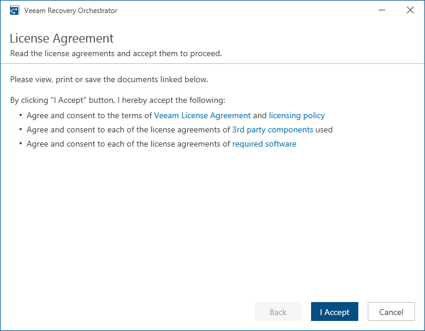

# Step 3. Accept License Agreement

At the License Agreement step of the wizard, read and accept the Veeam license agreement, the licensing policy, the 3rd party components license agreement and the license agreement of the required software. If you reject the agreements, you will not be able to continue installation.

