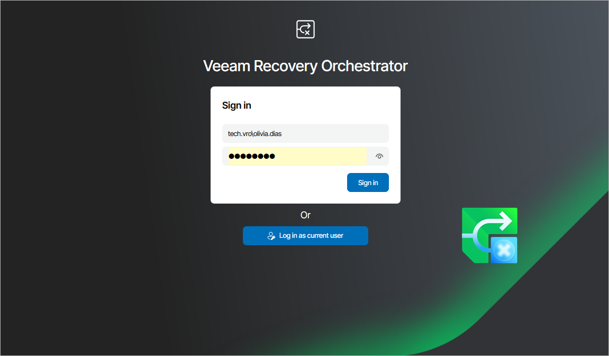
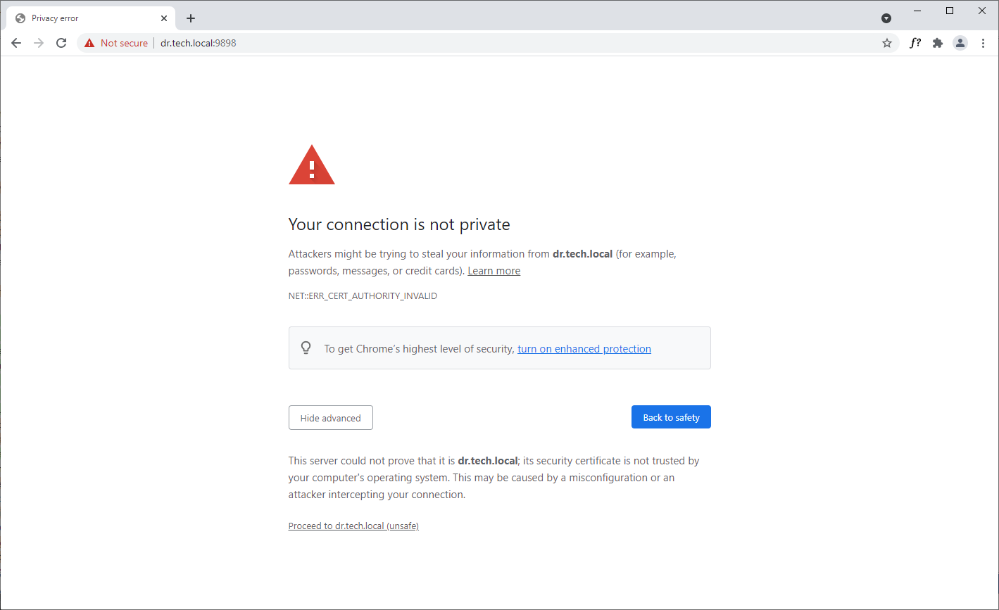

# Accessing Orchestrator UI

|  |
| --- |
| Important |
| Before you access the Orchestrator UI, make sure that TLS 1.2 is enabled both on the Orchestrator server and on the machine that you plan to use to access the UI. |

To access the Orchestrator UI, perform the following steps:

1. In a web browser, navigate to the Orchestrator UI web address. The address consists of an FQDN of the Orchestrator server and the website port specified during installation (by default, 9898). Note that the Orchestrator UI is available over HTTPS only.

https://<FQDN>:<port>

Keep in mind that Internet Explorer is no longer supported. To access the Orchestrator UI, use Microsoft Edge, Google Chrome or Mozilla Firefox.

1. If you log in for the first time, specify credentials of the local Administrator who performed Orchestrator installation. The user name must be specified in the DOMAIN\USERNAME or USERNAME format.

To authenticate using the credentials provided when logging into the system, click Log in as current user.

|  |
| --- |
| Tip |
| To be able to log in as the current user, you must first do the following:   1. Complete the Initial Configuration Wizard as described in section [After You Install](after_you_install.md). 2. Enable the Automatic logon with current user name and password option in the security setting of your browser. |

In future, you can configure users and roles to grant access to the Orchestrator UI. For more information, see [Managing User Accounts](managing_user_accounts.md).

1. Click Log in.

If [multi-factor authentication (MFA) is enabled](enabling_mfa.md), Orchestrator will prompt you to enter a code to verify the user identity. In the code field, enter the temporary six-digit code generated by the authentication application running on your trusted device. Then, click Confirm.

Configuring Trusted Connection

The Orchestrator UI uses SSL to ensure secure data communication between Orchestrator and a web browser.

When you install Orchestrator, you can generate or choose a self-signed certificate. In this case, when you try to access the Orchestrator UI in a web browser, the browser will display a warning notifying that the connection is untrusted (although it is secured with SSL).

To eliminate the warning, import the self-signed certificate to client machines (the machines from which you plan to access the Orchestrator UI website). To learn how to import SSL certificates, see [this Microsoft KB article](https://technet.microsoft.com/en-us/library/cc754489.aspx).

If you want to use the certificate [generated during installation](select_vro_certificate.md), perform the following steps:

1. Log in to the machine where Orchestrator is installed.
2. Open the Microsoft Management Console snap-in.

1. Navigate to Certificates > Trusted Root Certification Authorities > Certificates.
2. Export the Veeam Self-Signed Certificate following the instructions provided in [this Microsoft KB article](https://technet.microsoft.com/en-us/library/cc730988.aspx).

1. Import the Veeam Self-Signed Certificate to client machines.

|  |
| --- |
| Tip |
| If you still have issues accessing the Orchestrator UI, check your browser settings to ensure that the Orchestrator UI site is included in the Trusted Sites list. |

Logging Out

To log out of the Orchestrator UI, at the top right corner of the Veeam Recovery Orchestrator window, click the user name and then click Logout.

