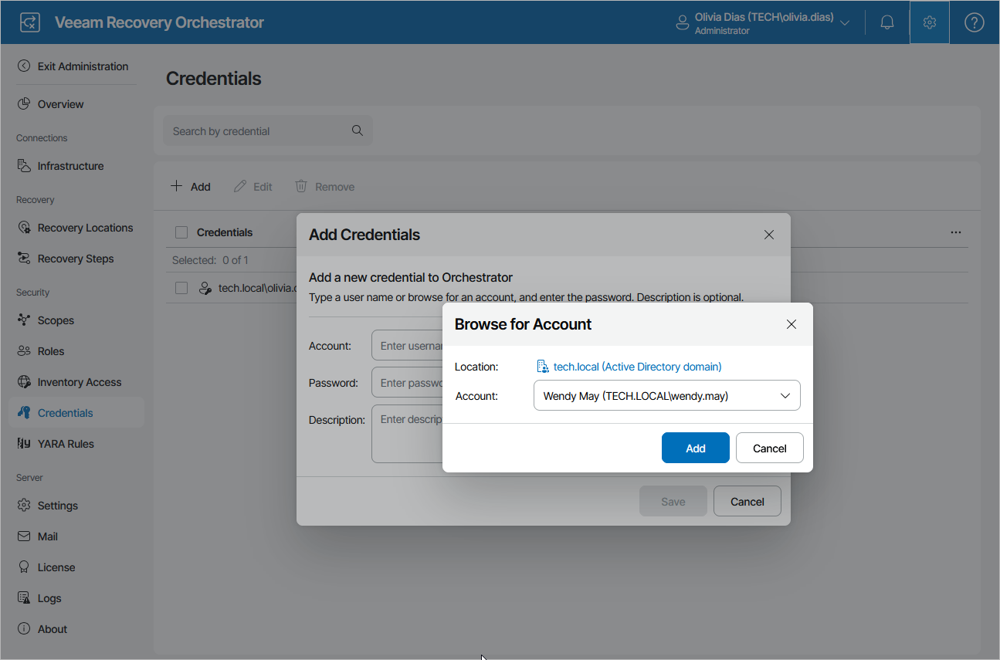

# Adding Credentials

If you want to manually add credentials under which recovery plan steps will be launched:

1. Switch to the Administration page.
2. Navigate to Credentials.
3. Click Add.
4. In the Add Credentials window, click Browse.
5. In the Browse for Account window:

1. In the Location field, select whether the account that you want to add belongs to a domain or to a local OS workgroup.
2. In the Account field, enter the account name.
3. Select the account and click Add.

1. In the Add Credentials window, enter a password for the account that you want to add, provide a description for future reference, and click Save.

|  |
| --- |
| Tip |
| You can also add any credentials of your choice, even those that do not exist yet. To do that, in the Add Credentials window, use the Account and Password fields to enter an account name and a password for the account, and click Save. |

By default, all credentials are not added to newly created scopes; only the Default Scope has all credentials added. To edit the list of credentials available for a scope and to add the new credentials, follow the instructions provided in section [Managing Inventory Items](managing_inventory_items.md).

