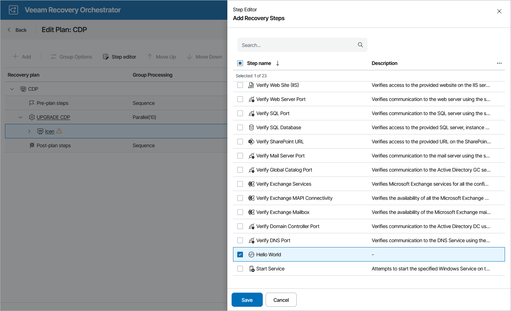

# Adding Custom Script Step to Plan

For each machine included in a recovery plan, you can add a custom script step to be performed when processing the machine:

1. Navigate to Recovery Plans.
2. Select the plan to which you want to add the custom step and click Manage > Edit.
3. On the Edit Plan page, in the Recovery plan column, expand the plan to see all its inventory groups. Then, select the necessary inventory group and click Step editor.
4. In the Step Editor window, click Add, select the custom step that you want to add to the plan and click Save.

|  |
| --- |
| Tip |
| You can also add a custom step to a specific machine as described in section [Configuring Steps](configuring_steps.md). |

After you add the custom step for the machine in the plan, check step parameter settings and modify them if required. For more information, see [Configuring Step Parameters](configuring_step_parameters.md).

