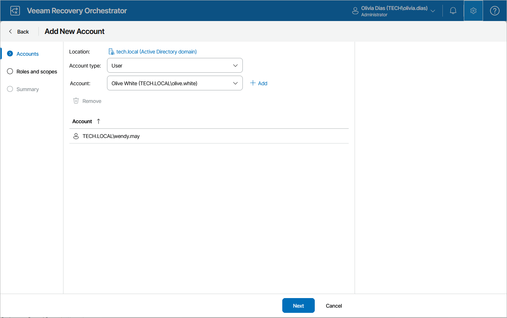

# Step 2. Specify Account

At the Accounts step of the wizard, do the following:

1. From the Account type list, select User or Group.
2. Use the Account and Location fields to enter the user or group name and to select the location to which the user or group belongs – either a domain or local OS workgroup.

For more information on the required account permissions, see [Permissions](permissions.md).

1. Click Add.
2. Repeat the procedure for each user or group that you want to add, and click Next.

