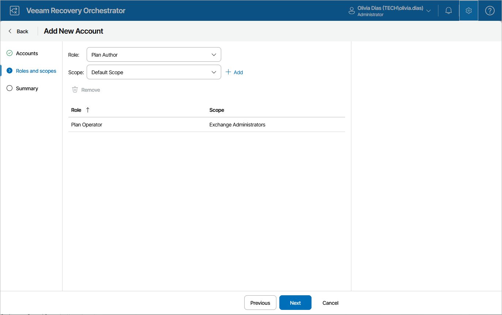

# Step 3. Select Role and Scope

At the Role and scopes step of the wizard, do the following:

1. From the Role drop-down list, choose the required role. For more information on roles that can be assigned to users and user groups working with the Orchestrator UI, see [Roles](roles.md).
2. From the Scope drop-down list, choose the required scope.
3. Click Add.
4. Repeat the procedure to add more role and scope pairs, and click Next.

|  |
| --- |
| Note |
| You can neither add nor remove scopes for Orchestrator Administrators — when you add a user with the Administrator role, this role is automatically assigned to all the existing scopes. |

