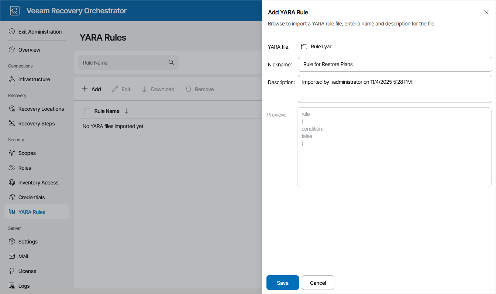

# Adding YARA Rule Files

To add a YARA file, do the following:

1. Switch to the Administration page.
2. Navigate to YARA Rules.
3. Click Add.
4. Complete the Add YARA Rule File wizard:

1. Click Browse to locate a YARA rule file.
2. Provide a nickname and description for the file. The maximum length of the rule name is 128 characters; the following characters are not supported: \* : / \ ? " < > | .
3. Click Save.

|  |
| --- |
| Note |
| You can add only one YARA rule file at a time. |

By default, all YARA rules are not added to newly created scopes; only the Default Scope has all rules added. To edit the list of rules available for a scope and to add the new rules, follow the instructions provided in section [Managing Inventory Items](managing_inventory_items.md).

