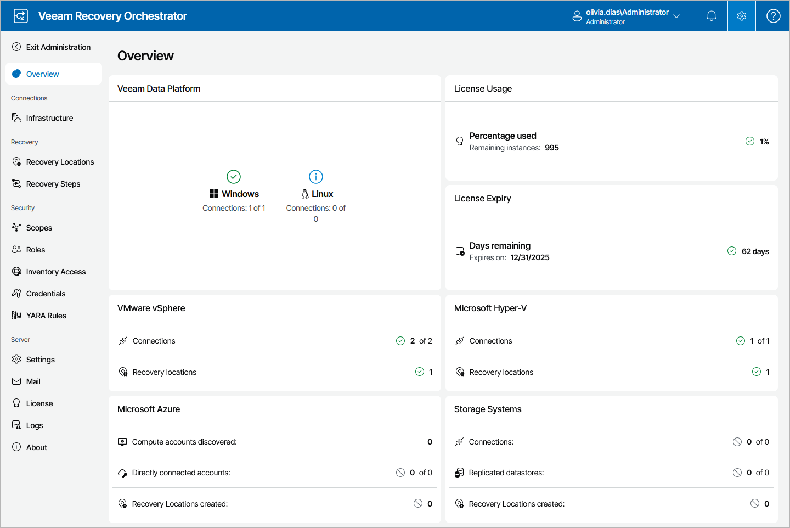

# Administration Dashboard

The dashboard on the Administration page of the Orchestrator UI provides at-a-glance real-time overview of your infrastructure:

* Shows the state of the connected Veeam Backup & Replication servers, vCenter Servers, Microsoft Hyper-V servers, storage systems and Microsoft Azure compute accounts.

* Displays information on license usage across the whole infrastructure.
* Shows the replication status of datastores included in storage plans.
* Displays all configured recovery locations.

