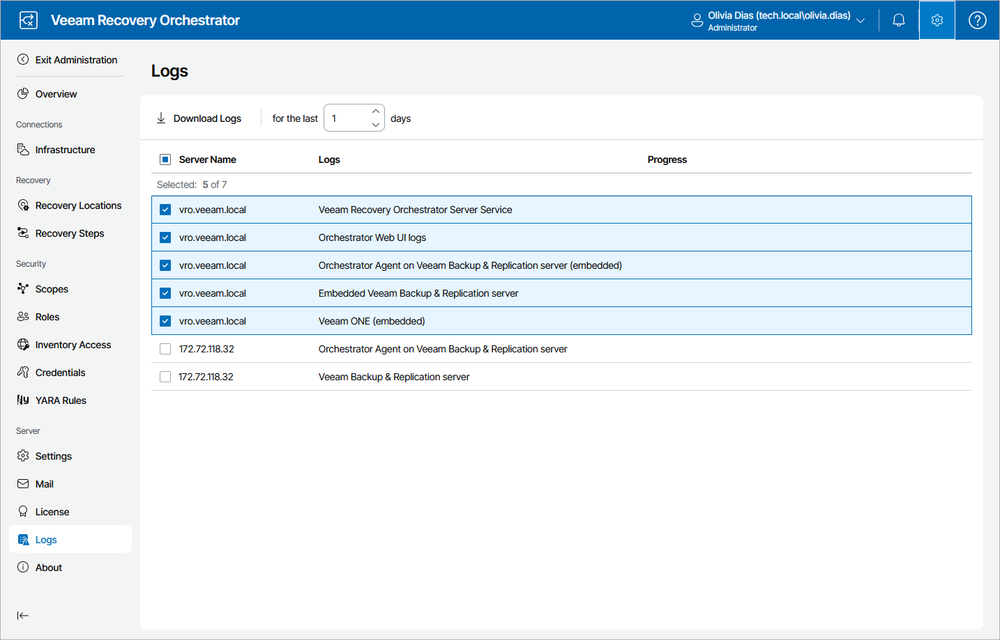

# Appendix B. Getting Technical Support

Veeam offers email and phone technical support for customers on maintenance and during the official evaluation period. For a better experience, provide the following details when contacting Veeam Customer Support:

* Version information for the product and its components
* Error message or accurate description of the problem you are facing
* Log files

For your convenience, the Orchestrator UI allows you to collect logs for each Orchestrator component separately. To do that:

1. Switch to the Administration page.
2. Navigate to Logs.
3. Select check boxes next to the necessary components.
4. Click Download Logs. Logs will be saved locally in the default download folder.

|  |
| --- |
| Note |
| Every archive with log files that you download contains an anonymized file with the current Orchestrator configuration and statistical information. This file can be used by Orchestrator product management to improve the product. No information will be shared outside of Veeam at any time. |

To submit your support ticket or obtain additional information, visit the [Veeam Customer Support Portal](https://www.veeam.com/support.html). Before contacting Veeam Customer Support, consider searching for a resolution on [Veeam R&D Forums](https://forums.veeam.com/).

