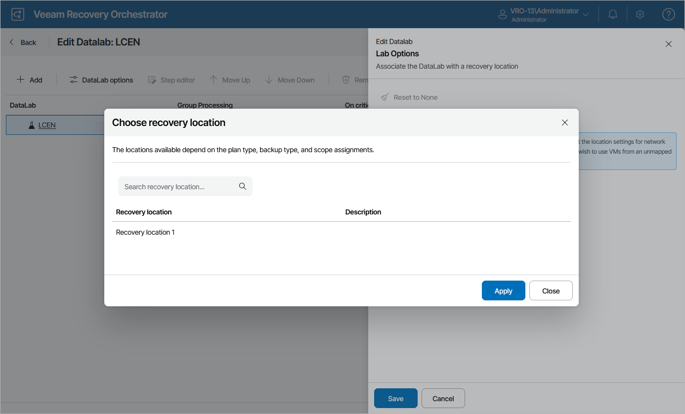

# Associating DataLabs

If you want to verify machines in a DataLab that contains a lab group, you must associate the DataLab with a recovery location whose settings will be applied to the machines being verified to connect them to the correct network, to reconfigure machine IP addresses and to set the backup copy preference. For more information on these settings, see [Adding VMware vSphere Recovery Locations](adding_restore_locations.md).

To associate a DataLab with a recovery location, do the following:

1. Navigate to DataLabs.
2. In the DataLab column, select a DataLab to which you want to assign the recovery location and click DataLab Editor.

For a DataLab to be displayed in the DataLab list, it must be added to the scope as described in section [Managing Inventory Items](managing_inventory_items.md).

1. On the Edit DataLab page, click DataLab options. The Edit DataLab window will open.
2. In the Edit DataLab window, click the link in the Associated recovery location field, select a recovery location with which you want to associate this DataLab, and click Apply.

For a recovery location to be displayed in the list of available recovery locations, its [compute resources](restore_location_compute_resources.md) must contain the host where the DataLab is deployed, and the location must be added in the selected scope as described in section [Managing Inventory Items](managing_inventory_items.md).

