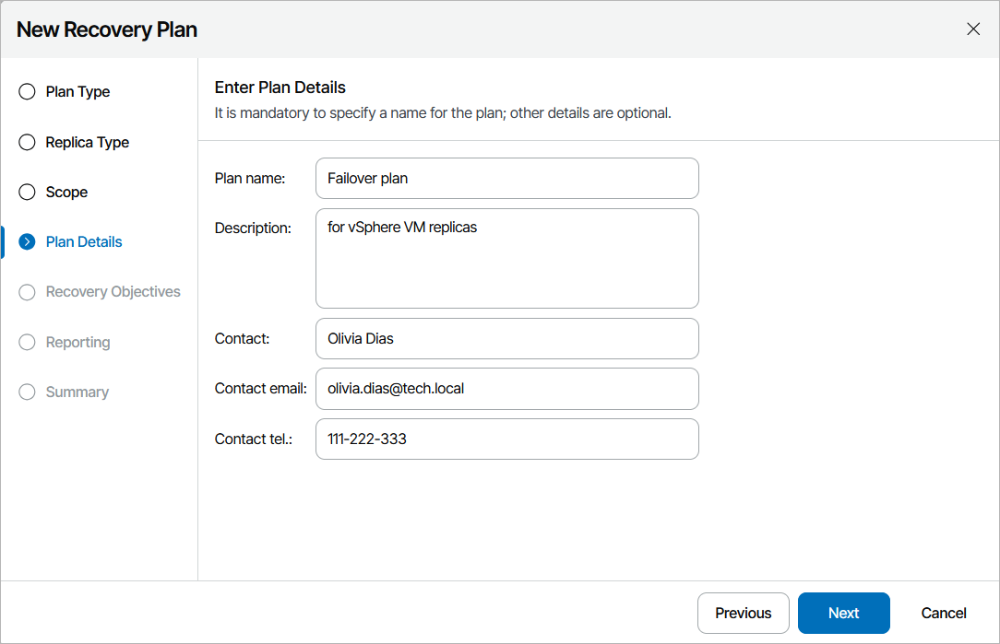

# Step 4. Specify Plan Name and Description

At the Plan Details step of the wizard, use the Plan name and Description fields to enter a name for the new plan and to provide a description for future reference. The maximum length of the plan name is 128 characters; the following characters are not supported: \* : / \ ? " < > | .

You can also provide a contact name, email and telephone number of a person responsible for the plan.

