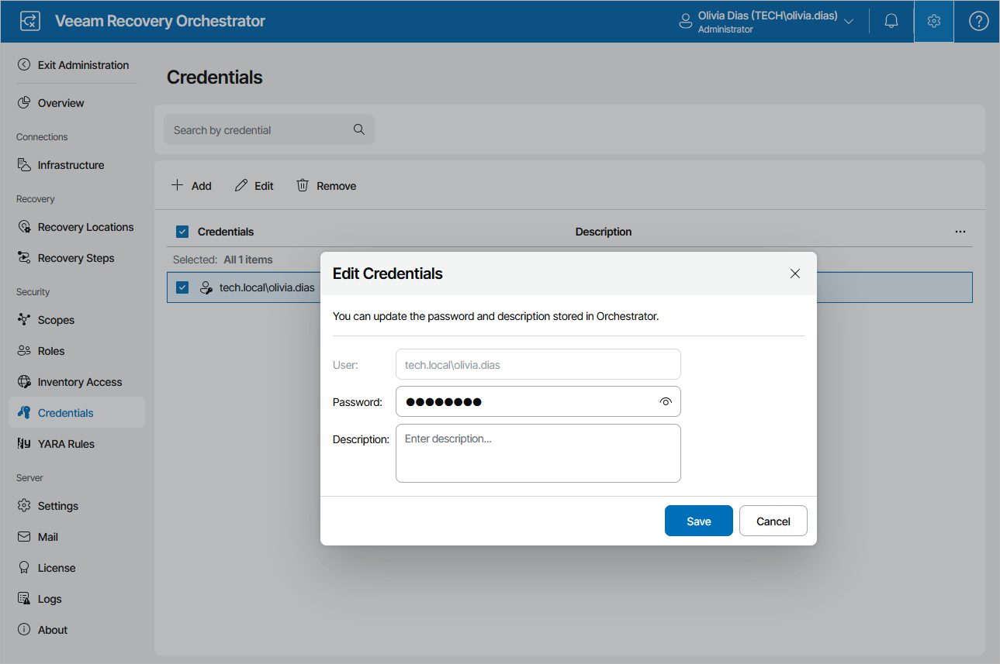

# Changing Passwords

To change a password for an account in the Orchestrator UI, do the following:

1. Switch to the Administration page.
2. Navigate to Credentials.
3. Select a credential that you want to modify and click Edit.
4. In the Edit Credentials window:

1. In the Password field, enter a new password.
2. Click Save.

