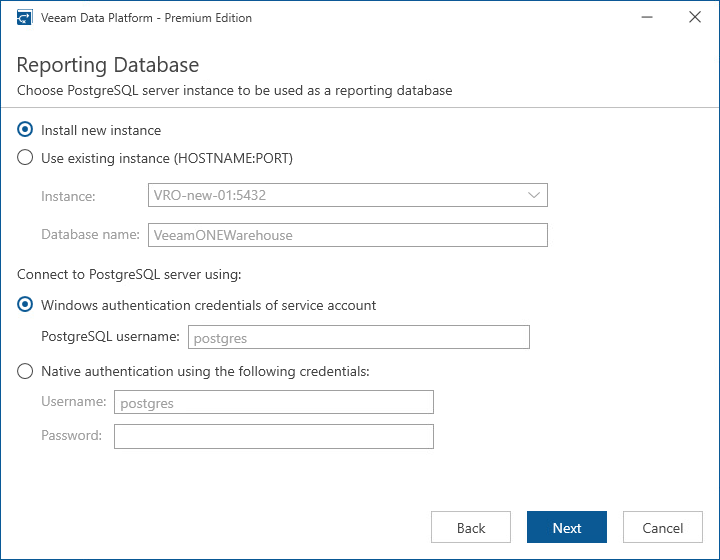

# Step 10. Choose PostgreSQL Server

[This step applies only if you have clicked Customize Settings at the Ready to Install step of the setup wizard]

At the Reporting Database step of the wizard, choose a PostgreSQL server instance that will host the PostgreSQL reporting database that Veeam ONE will use to store PostgreSQL logs and metrics required to generate reports:

* If on the target machine you do not have a PostgreSQL server instance that you can use for Orchestrator, select the Install new instance option. In this case, the setup will install PostgreSQL server locally, on the machine where you are installing Orchestrator.

|  |
| --- |
| Note |
| If a PostgreSQL Server instance that meets Orchestrator system requirements is detected on the machine, you can only use the existing local PostgreSQL server instance or choose one that runs remotely. In this case, the option to install a new PostgreSQL instance will be unavailable. |

* If you want to use an existing local or remote PostgreSQL server instance, select the Use existing instance option and choose a local PostgreSQL server instance.

To connect to the PostgreSQL server instance, you must provide valid credentials for an account that will be used by Orchestrator components to access the PostgreSQL server database. You can either specify credentials explicitly or use Windows authentication credentials. Note that the account must have the System Administrator rights on the selected PostgreSQL server instance.

