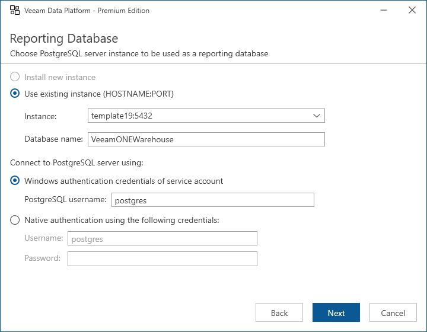

# Step 9. Choose PostgreSQL Server

The installer will automatically detect the PostgreSQL Server instance (installed locally or remotely) that will be used to host the PostgreSQL reporting database. The installer will also detect credentials for an account used by Orchestrator components to access the database.

At the Reporting Database step of the wizard, review configuration information and click Next.

