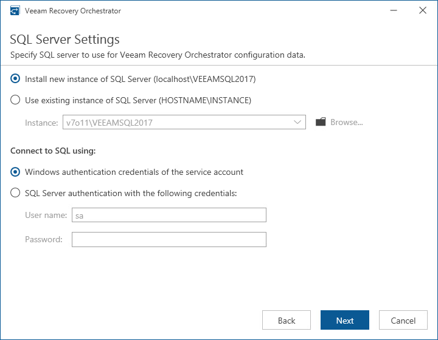

# Step 9. Choose SQL Server

[This step applies only if you have clicked Customize Settings at the Ready to Install step of the setup wizard]

At the SQL Server Settings step of the wizard, choose a Microsoft SQL Server instance that will host the Orchestrator database:

* If on the target machine you do not have a Microsoft SQL Server instance that you can use for Orchestrator, select the Install new instance of SQL Server option. In this case, the setup will install Microsoft SQL Server Express locally, on the machine where you are installing Orchestrator.

|  |
| --- |
| Note |
| If a Microsoft SQL Server instance that meets Orchestrator system requirements is detected on the machine, you can only use the existing local Microsoft SQL Server instance or choose one that runs remotely. In this case, the option to install a new Microsoft SQL instance will be unavailable. |

* If you want to use an existing local or remote Microsoft SQL Server instance, select the Use existing instance of SQL Server option and choose a local Microsoft SQL Server instance, or browse to a Microsoft SQL Server instance running remotely. You can either enter the address of the instance manually or use the Browse button to search among available remote instances.

To connect to the Microsoft SQL Server instance, you must provide valid credentials for an account that will be used by Orchestrator components to access the Microsoft SQL Server database. You can either specify credentials explicitly or use Windows authentication credentials. Note that the account must have the System Administrator rights on the selected Microsoft SQL Server instance.

|  |
| --- |
| Note |
| During Orchestrator installation, by default, the setup will install Microsoft SQL Server Express to host Orchestrator databases. However, it is not recommended that you use the Express Edition in any production Orchestrator deployments — it should be used for product evaluation only. |

