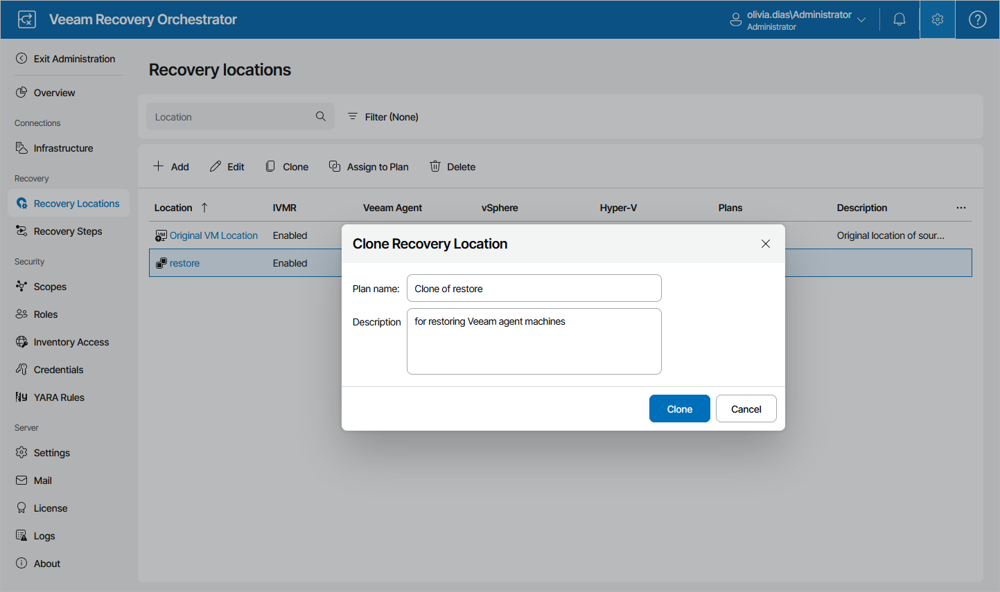

# Cloning Recovery Locations

You can also create a new recovery location by cloning a location that already exists. The new location will have the same configuration as the existing location, which means that all items configured for the existing location will be applied to the new location.

To clone a recovery location:

1. Select an existing location that you want to use as a template for the new scope and click Clone.
2. In the Clone Recovery Location window:

1. Use the Name and Description fields to enter a name for the new location and to provide a description for future reference.

The maximum length of the scope name is 128 characters; the following characters are not supported: \* : / \ ? " < > | .

1. Click Clone to save the location.

