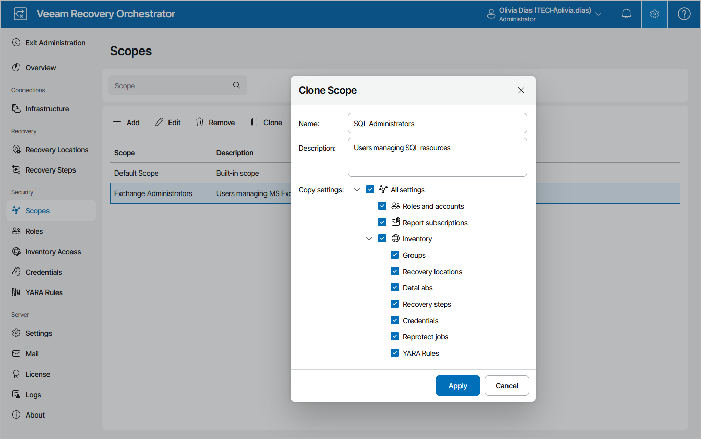

# Cloning Scopes

You can also create a new scope by cloning a scope that already exists. When cloning a scope, you can copy its settings so that you do not have to configure the same settings once again for the new scope. The new scope will have the same configuration as the existing scope, which means that all items configured for the existing scope will be applied to the new scope.

To clone a scope:

1. Select an existing scope that you want to use as a template for the new scope and click Clone.
2. In the Clone Scope window:

1. Use the Name and Description fields to enter a name for the new scope and to provide a description for future reference.

The maximum length of the scope name is 128 characters; the following characters are not supported: \* : / \ ? " < > | .

1. In the Copy settings list, select check boxes next to settings that you want to copy from the existing scope.
2. Click Apply to save the scope.

