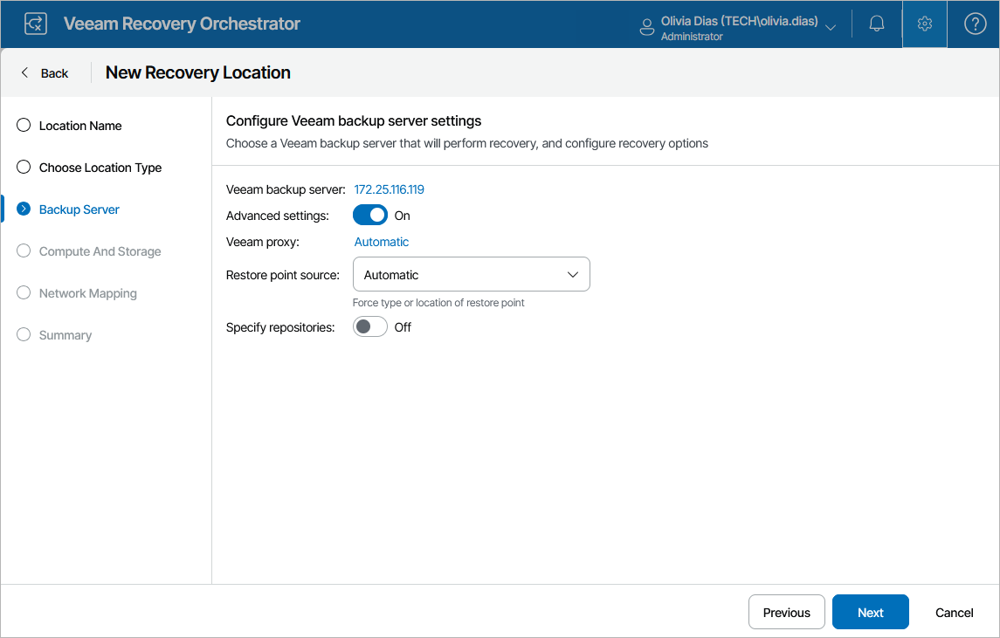

# Step 3. Choose Recovery Options

At the Backup Server step of the wizard, select a Veeam Backup & Replication server that will manage the process of recovering machines to Microsoft Azure. Note that one recovery location can be associated with one Veeam Backup & Replication server only.

For a Veeam Backup & Replication server to be displayed in the list of available servers, it must be added to Orchestrator as described in section [Connecting Veeam Backup & Replication Servers](connecting_backup_servers.md).

|  |
| --- |
| Important |
| * To restore workloads to Microsoft Azure, you must add a Microsoft Azure compute account to Veeam Backup & Replication. When you add an Azure compute account, Veeam Backup & Replication imports information about subscriptions and resources associated with this account.   If you do not add a compute account to the configuration of a Veeam Backup & Replication server, you will not be able to choose the server when creating a Microsoft Azure recovery location. For more information on adding Microsoft Azure compute accounts, see the Veeam Backup & Replication User Guide, section [Microsoft Azure Compute Accounts](https://helpcenter.veeam.com/docs/vbr/userguide/restore_azure_accounts.html?ver=13).   * The added account must have the permissions required to access Microsoft Azure resources. For more information, see the Veeam Backup & Replication User Guide, section [Creating Custom Role for Azure Account](https://helpcenter.veeam.com/docs/vbr/userguide/azure_custom_role.html?ver=13). |

Additionally, you can set the Advanced settings toggle to On and configure the following settings.

Configuring Azure Proxies

Veeam Backup & Replication servers can use Azure restore proxy appliances to speed up the recovery process. For more information on Azure proxy appliances, see the Veeam Backup & Replication User Guide, section [Managing Azure Restore Proxy Appliances](https://helpcenter.veeam.com/docs/vbr/userguide/restore_azure_proxy.html?ver=13).

In the Veeam proxy field, specify the proxy appliances to be used. To do that, select a proxy appliance in the list of available proxy appliances and click Add. If want to select a cloud repository as a target location for storing restore points, choose a cloud proxy appliance to speed up the recovery process.

|  |
| --- |
| Important |
| To be able to recover Linux workloads, you must configure a Linux helper appliance [when adding a Microsoft Azure compute account](https://helpcenter.veeam.com/docs/vbr/userguide/restore_azure_acc_lin.html?ver=13) to the backup infrastructure. |

Configuring Recovery Options

From the Restore point source drop-down list, choose whether you want Orchestrator to use backup files created by backup jobs, their copies created by backup copy jobs or files that are stored in [scale-out backup repositories](https://helpcenter.veeam.com/docs/vbr/userguide/backup_repository_sobr.html?ver=13). Alternatively, you can choose to let the product select the files automatically, based on the most recent restore points. For more information on the way Orchestrator selects backup files and restore points to recover machines when performing restore operations, see [How Orchestrator Selects Backup Files](understanding_backup_file_selection.md).

Specifying Backup Repositories

Set the Specify repositories toggle to On to choose backup repositories where the restore points of machines that you plan to recover are stored. To do that, click Add, select a repository in the list of available repositories and click Add.

For a backup repository to be displayed in the list of the available repositories, it must be added to the backup infrastructure as described in section [Adding Backup Repositories](https://helpcenter.veeam.com/docs/vbr/userguide/repo_add.html?ver=13). You can use directly attached storage (Windows, Linux), object storage (Veeam Data Cloud Vault, Microsoft Azure, Wasabi) and scale-out backup repositories. Tape and deduplicating storage appliances are not supported.

|  |
| --- |
| Important |
| For Veeam Backup & Replication to be able to access the selected repositories using your cloud accounts, the credentials of these accounts must be kept up to date. This means that if you update credentials of a cloud account that is used to connect to a cloud service, you must also update these credentials in the Veeam Backup & Replication console as described in the Veeam Backup & Replication User Guide, section [Cloud Credentials Manager](https://helpcenter.veeam.com/docs/vbr/userguide/cloud_credentials.html?ver=13). |

