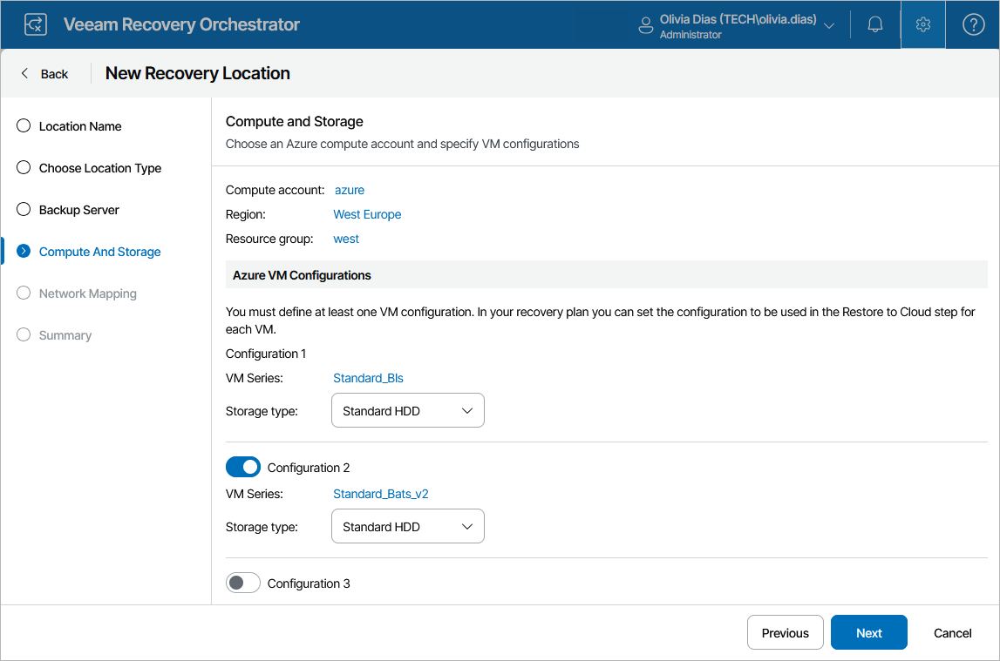

# Step 4. Configure Compute and Storage Settings

At the Compute and Storage step of the wizard, configure the following settings:

1. Click the link in the Compute account field and specify a Microsoft Azure compute account added to Veeam Backup & Replication that you want to use to recover machines.
   1. From the Region drop-down list, select a Microsoft Azure region in which the recovered VMs will reside.

   For a region to be displayed in the list of available regions, it must belong to the subscription specified at step 2. Note that Early Updates Access Program (EUAP) regions are not supported.

   |  |
   | --- |
   | Note |
   | For Orchestrator to deploy the recovered VMs in the selected region, you must have sufficient resource quota allocated to your subscription. To learn how to check your quotas, see [Microsoft Azure documentation](https://learn.microsoft.com/en-us/azure/azure-resource-manager/management/azure-subscription-service-limits). |

   1. From the Resource group drop-down list, select a resource group to which the recovered VMs will belong.

   For a resource group to be displayed in the Resource Group list, it must be created for the region specified at step 3 in the Microsoft Azure portal, as described in [Microsoft Docs](https://learn.microsoft.com/en-us/azure/azure-resource-manager/management/manage-resource-groups-portal).

   1. In the Azure VM Сonfigurations section, specify a VM configuration (that is, a combination of a VM series and disk type) that Orchestrator will use to create new VMs in Microsoft Azure.

   To help you choose the VM series, the table in the Choose VM Series window will provide information on the maximums for the number of vCPU cores, system RAM and attached disks for each available VM size. For the full description of Microsoft Azure VM sizes, see [Microsoft Docs](https://learn.microsoft.com/en-us/azure/virtual-machines/sizes).

   The specified VM series will be used as the basis for machines recovered in Microsoft Azure as new VMs. The created VMs will be customized to best match the CPU and memory configuration of the source machines. If you want different machines to be recovered using different settings, you can add up to 2 more VM configurations. If you create another VM configuration, you must also modify the parameters of the Restore to Azure step to use it, as described in section [Configuring Plan Steps](configuring_plan_steps.md).

   

