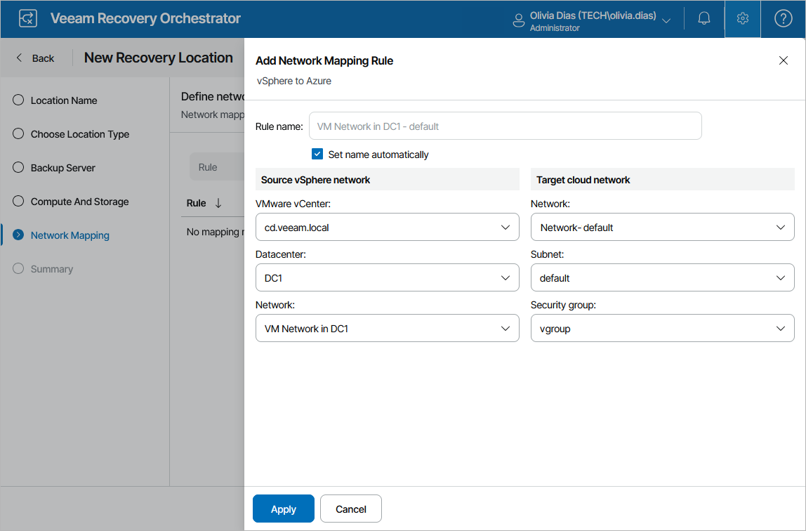
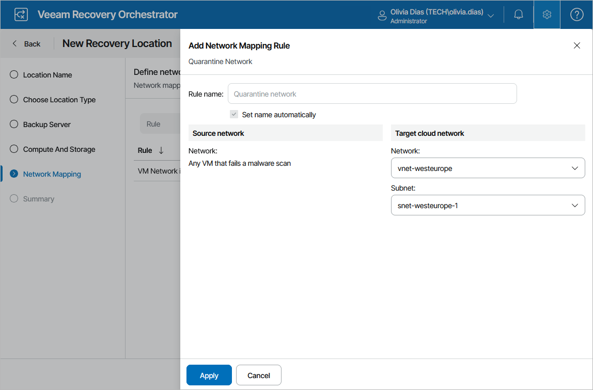

# Step 5. Configure Network Mapping

When you recover a machine from a Veeam agent backup or a VM from a vSphere backup to a cloud environment, Orchestrator is not able to connect the recovered VM to the same networks as the source machine — that is why you must create at least one network mapping rule for the location so that the recovered VM is connected to the correct network.

To configure network mapping, click Add at the Network Mapping step of the wizard. Then, do the following in the Add Network Mapping Rule window:

1. Depending on whether you plan to recover machines from vSphere or agent backups, do the following in the Source network section:

* To recover machines from Veeam agent backups, specify a range of IP addresses that contains the IP addresses of the source agent machines. Alternatively, create a separate network mapping rule to map each individual IP address.
* To recover VMs from vSphere backups, select a vCenter Server that manages source VMs, a network to which the source VMs are connected, and a datacenter or a cluster where the source VMs reside.

For a vCenter Server to be displayed in the vCenter Server list, it must be connected to Orchestrator as described in section [Connecting VMware vSphere Servers](connecting_vsphere_servers.md).

|  |
| --- |
| Note |
| Orchestrator supports IP addresses in the IPv4 format only. If a machine that you want to recover has a single IPv6 address, you must create a mapping rule 0.0.0.0/0 (this will map all networks). Otherwise, Orchestrator may halt the recovery process. |

1. In the Target network section, select a virtual network and a subnet to which you want to connect the recovered VMs. For a virtual network to be displayed in the Cloud network list, it must be created in the Microsoft Azure portal for the region selected at [step 4](cloud_location_compute_storage.md#region), as described in [Microsoft Docs](https://learn.microsoft.com/en-us/azure/virtual-network/manage-virtual-network). For a subnet to be displayed in the Subnets list, it must be created in the Microsoft Azure portal for the specified virtual network, as described in [Microsoft Docs](https://learn.microsoft.com/en-us/azure/virtual-network/virtual-network-manage-subnet).

You can also specify a security group (virtual firewall) that will be associated with the recovered VMs. For a network security group to be displayed in the Security Groups list, it must be created and associated to the necessary subnet in the Microsoft Azure portal as described in [Microsoft Docs](https://learn.microsoft.com/en-us/azure/virtual-network/manage-network-security-group?tabs=network-security-group-portal).

|  |
| --- |
| Important |
| * If the IP address ranges for different rules overlap, Orchestrator will use the mapping in the rule with the narrowest range. * Even if a source machine had multiple network adapters, the recovered VM will have only one network adapter (vNic). |

Configuring Quarantine Network

You can scan machine disks for possible malware before restoring them to the production environment. During malware scan, Orchestrator iterates through the number of restore points [specified while running the plan](running_cloud.md) one by one to detect a restore point with no malware. By default, if all restore points of a machine are infected, Orchestrator halts the restore. However, you can instruct Orchestrator to restore the infected machine to a quarantine network.

At the Network Mapping step of the wizard, click Add Mapping > Quarantine Network and specify a network and a subnet to which you want to connect the infected machines. For a virtual network to be displayed in the Target cloud network list, it must be created in the Microsoft Azure portal for the region selected at [step 4](cloud_location_compute_storage.md#region), as described in [Microsoft Docs](https://learn.microsoft.com/en-us/azure/virtual-network/manage-virtual-network). For a subnet to be displayed in the Subnet list, it must be created in the Microsoft Azure portal for the specified virtual network, as described in [Microsoft Docs](https://learn.microsoft.com/en-us/azure/virtual-network/virtual-network-manage-subnet).

You can also specify a security group (virtual firewall) that will be associated with the recovered VMs. For a network security group to be displayed in the Security group list, it must be created and associated to the necessary subnet in the Microsoft Azure portal as described in [Microsoft Docs](https://learn.microsoft.com/en-us/azure/virtual-network/manage-network-security-group?tabs=network-security-group-portal).

|  |
| --- |
| Note |
| Orchestrator allows you to perform malware scan only for those machines whose restore points are stored in on-premises or scale-out repositories. If a restore point is stored in an object storage repository, Orchestrator will be unable to perform the scan. For more information, see [Malware Scan](malware_scan_overview.md). |

