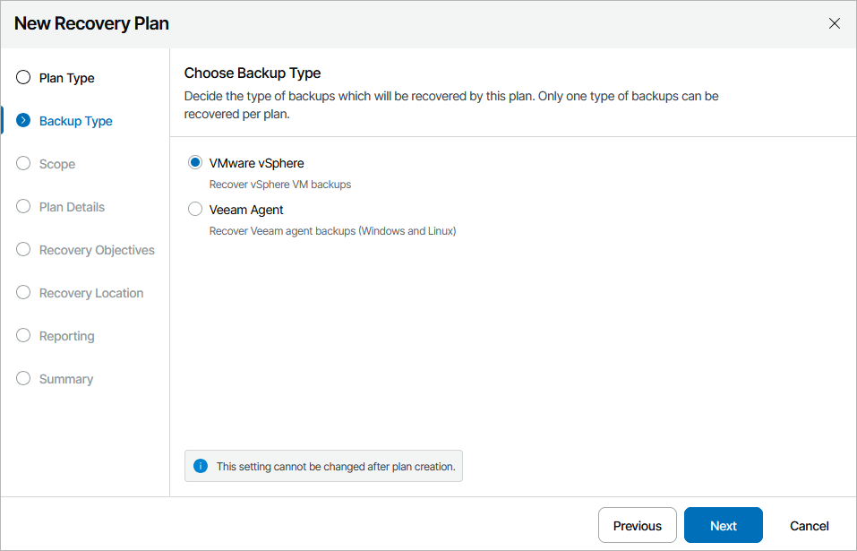

# Step 2. Choose Backup Type

At the Backup Type step, specify whether you want to recover machines from VM backups or Veeam agent backups.

|  |
| --- |
| Note |
| Orchestrator only supports agent backups created by Veeam Agent for Microsoft Windows or Veeam Agent for Linux. |

