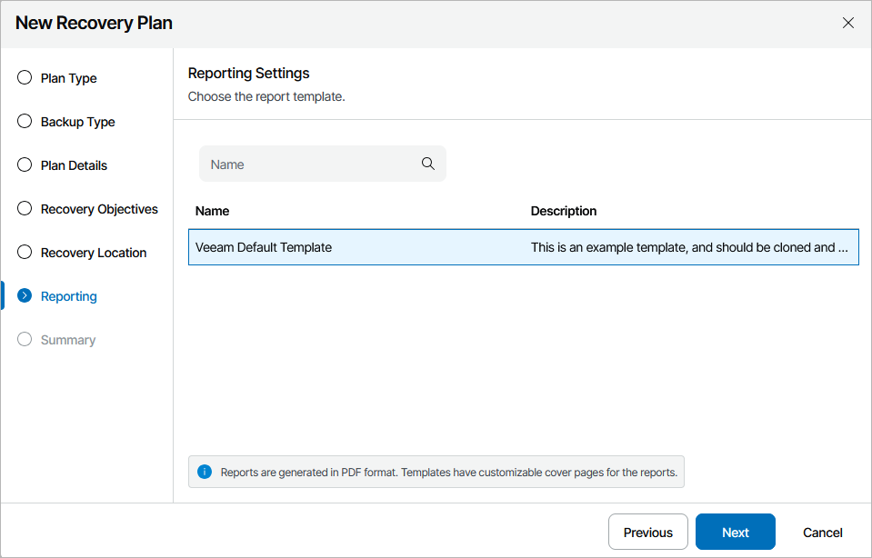

# Step 7. Select Report Template

At the Reporting step of the wizard, select a document template that will be used as the cover page for all Orchestrator reports.

For a custom document template to be displayed in the list, it must be created and customized as described in section [Managing Templates](managing_templates.md).

