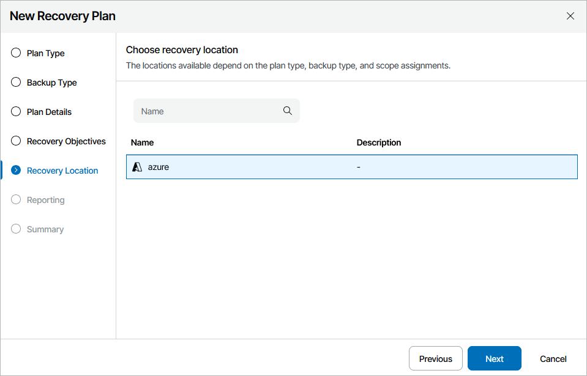

# Step 6. Select Recovery Location

At the Recovery Location step of the wizard, select a location to which inventory groups included in the plan will be restored.

For a recovery location to be displayed in the list of available locations, it must be created and added to the list of available inventory items available for the scope, as described in section [Managing Recovery Locations](managing_recovery_locations.md).

