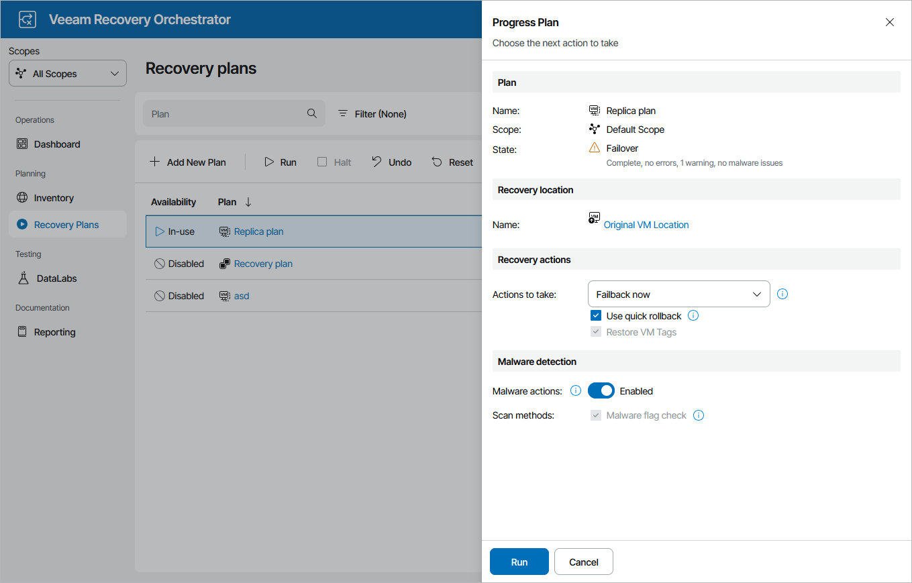

# Committing Failback

To commit failback for a plan in the FAILBACK state:

1. Navigate to Recovery Plans.
2. Select the plan and click Run.
3. In the Progress Plan window, do the following:

1. For security purposes, retype your password and click Next.
2. In the Recovery actions section, select the Failback now option to switch from VM replicas to the source VMs immediately.
3. Review configuration information and click Run.

|  |
| --- |
| Tip |
| After the commit failback process completes, Orchestrator will leave the plan in the IN-USE mode. By design, this makes the results of the commit failback process accessible in the Orchestrator UI as long as required, and also prevents the plan from being modified by any automatic updates related to infrastructure changes.  If you want to perform any further actions with the plan (for example, to test the plan, to run readiness checks or to execute the plan again), reset the plan as described in section [Resetting Replica Plans](resetting_replica_plans.md). |

