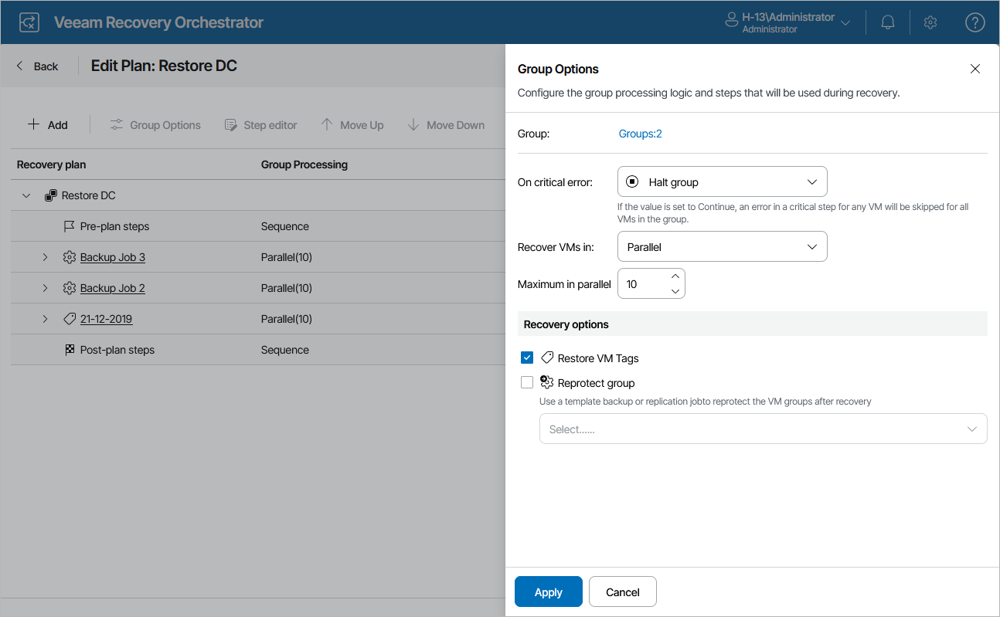

# Configuring Group Settings

You can configure the following group settings:

1. Navigate to Recovery Plans.
2. Select the plan that contains an inventory group you want to edit and click Manage > Edit.
3. On the Edit Plan page, in the Recovery plan column, expand the plan to see all its inventory groups. Then, select the necessary inventory group and click Group Options.
4. In the Group Options window, do the following:

1. Use the options in the On critical error drop-down list to choose whether you want to halt plan execution if machine recovery fails.
2. Use the options in the Recover VMs in drop-down list to choose whether you want to recover machines in sequence or in parallel. If you select to process machines simultaneously, use the Maximum in parallel field to specify the maximum number of VMs processed at the same time.
3. Select the Restore VM Tags check box if you want the recovered VMs to have the same tags as the source machines.
4. Use the Reprotect group check box to choose whether you want to protect VMs in the plan post-recovery with a backup or replication job. Keep in mind that you cannot reprotect VMs recovered to a Microsoft Hyper-V environment.

If you select the Reprotect group check box, you must specify a backup or replication job to be used as a template for a new job that will reprotect recovered VMs. To do that, select the required job from the drop-down list.

For a template backup or replication job to be displayed in the list of available jobs, it must be created and added to the list of inventory items for the scope, as described in section [Editing Template Jobs](editing_template_jobs.md).

|  |
| --- |
| Important |
| The new job will consume Veeam Backup & Replication licenses to protect the machines. That is why you must take into account the number of licenses installed on the Veeam Backup & Replication server, so that the number of managed objects does not exceed the license limit. |

1. Click Apply to save changes made to the group settings.

1. Repeat the procedure for each inventory group that you want to edit and click Save Plan.

