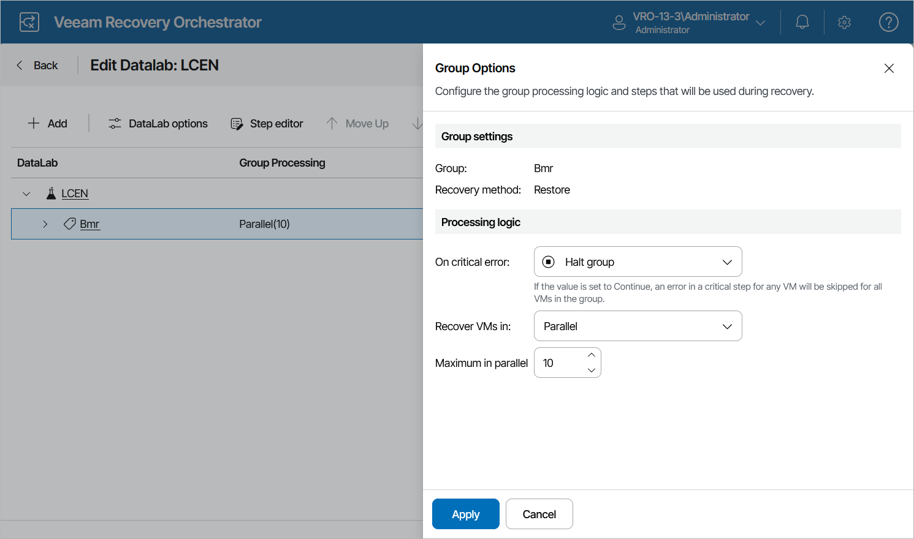

# Configuring Lab Groups

If required, you can customize lab group settings in much the same way as [editing a recovery plan](editing_recovery_plans.md).

1. Navigate to DataLabs.
2. In the DataLabs column, click the name of a DataLab whose groups you want to configure.

For a DataLab to be displayed in the DataLabs list, it must be added to the scope as described in section [Managing Inventory Items](managing_inventory_items.md).

1. On the DataLab Details page, in the Recovery plan column, select the necessary DataLab and click DataLab editor.
2. On the Edit DataLab page, select the newly created lab group and do the following:

* To customize the configured VM recovery options, click DataLab options. In the Group Options window, specify the required settings following the instructions provided in section [Configuring Group Settings](configuring_group_settings.md), and click Apply.
* To define the order in which machines will be started, use the Move Up and Move Down arrows.
* To select steps performed when processing each machine, expand the lab group, choose the necessary machine, click Step editor, and follow the instructions provided in section [Configuring Steps](configuring_steps.md).
* To modify parameter settings for each step, expand the lab group, choose the necessary machine, select the step whose parameters you want to modify, click Step editor, and follow the instructions provided in section [Configuring Step Parameters](configuring_step_parameters.md).
* To delete the lab group, click Remove.

1. To save changes made to the lab group settings, click Save Lab.

By default, Orchestrator skips a number of steps during the plan testing process — Generate Event, Send Email, Shutdown Source VM and VM Power Actions. That is why when you create or edit a DataLab, you cannot add these steps. If you still want to add these steps, set the During DataLab Tests parameter value to Execute for each step as described in section [Configuring Step Parameters](configuring_step_parameters.md).

|  |
| --- |
| Important |
| A common use case for lab groups is to provide domain controllers for the test environment. If there are domain controllers in a lab group, it is essential to add the Prepare VM as Domain Controller step. By design, it will automatically become the first step in the step execution order.  You may also optionally add domain controller-specific checks, such as Verify Domain Controller Port and Verify Global Catalog Port. These steps must be performed after the Check Networks step. |

|  |
| --- |
| Note |
| There is no clear use case for replicating a domain controller. Failing over to a domain controller that contains an old version of the Active Directory database is not recommended by Microsoft. The only real use case for replicating a domain controller is to use it in an isolated lab group, and you may need to create a replication job specifically for that purpose.  To learn how to restore a domain controller from an image-aware backup, see [this Veeam KB article](https://www.veeam.com/kb2119). To learn how to back up a domain controller, see [this Veeam KB article](https://www.veeam.com/blog/backing-up-domain-controller-best-practices-for-ad-protection.html). |

