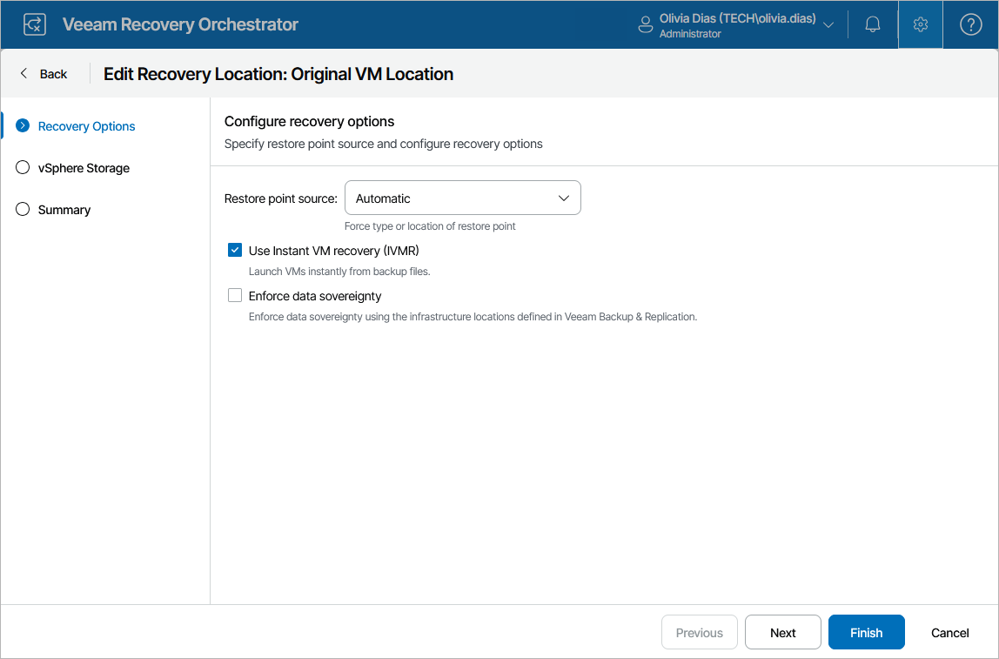
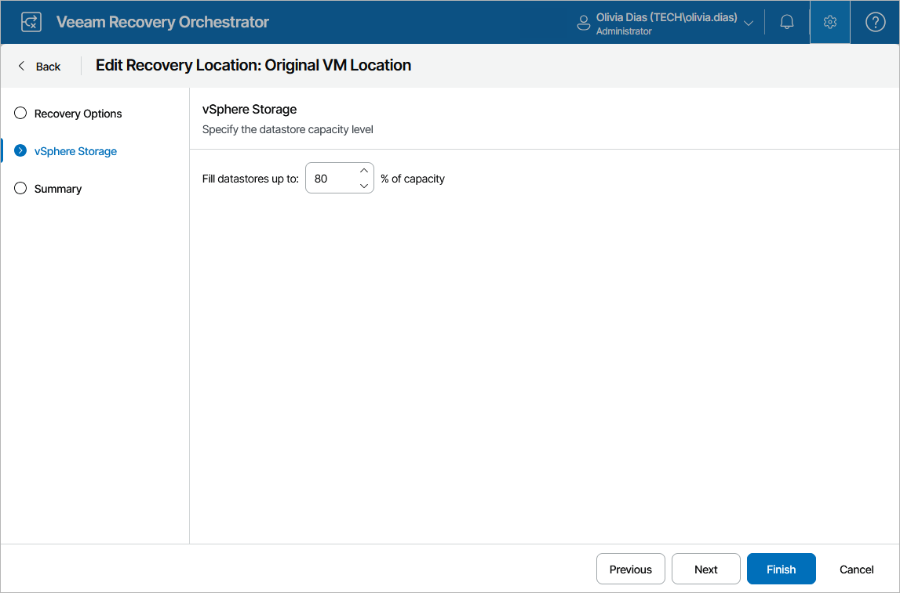
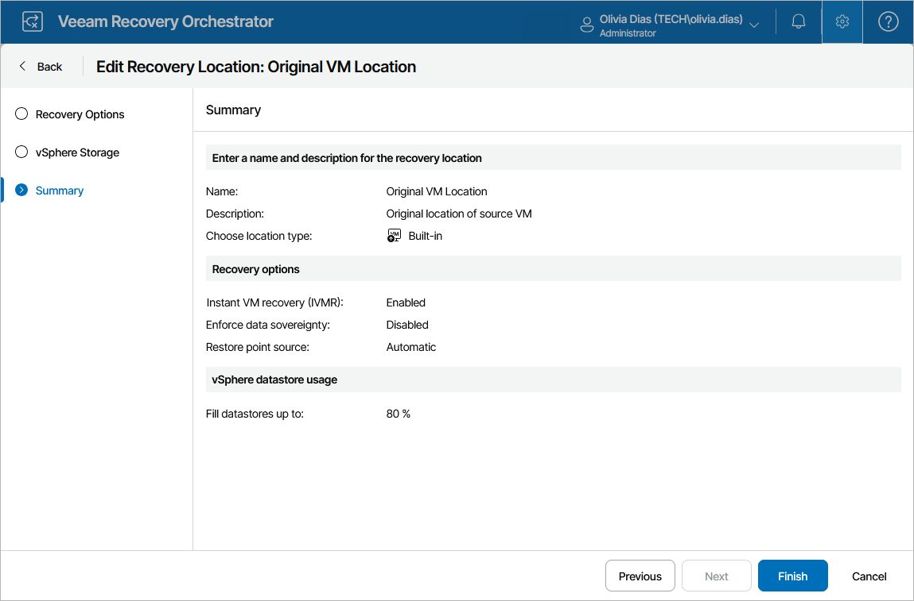

# Editing Original VM Location

Since all resource groups included in the Original VM Location are empty by default and depend on processed machines, you cannot customize its resource settings. However, you can still customize some general settings for the location:

1. Switch to the Administration page.
2. Navigate to Recovery Locations.
3. In the list of recovery locations, select Original VM Location, and click Edit.
4. Complete the Edit Recovery Location wizard:

1. To change the configured recovery options, follow the instructions provided in section [Adding VMware vSphere Recovery Locations](restore_location_recovery_options.md) (step 3).

1. To change the datastore capacity level that must not be breached during the recovery process, follow the instructions provided in section [Adding VMware vSphere Recovery Locations](restore_location_recovery_options.md) (step 3).

1. At the Summary step of the wizard, review configuration information and click Finish to confirm the changes.

