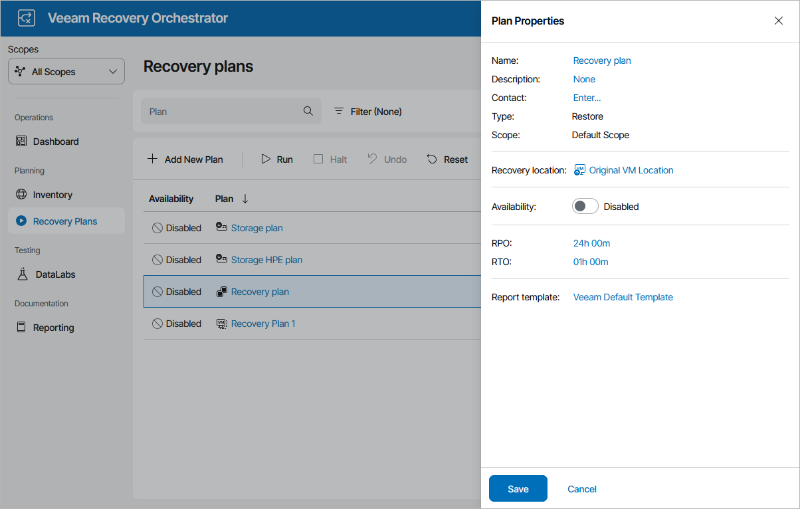

# Configuring Plan Properties

For each recovery plan, you can configure settings specified while creating the plan:

1. Navigate to Recovery Plans.
2. Select the plan.
3. From the Manage menu, select Properties.

OR-

Right-click the plan name and select Manage > Properties.

1. In the Plan Properties window, do the following:

1. To provide a new name, description, contact name, email or telephone number of a person responsible for the plan, follow the instructions provided in section [Creating Replica Plans](replica_plan_name.md) (step 4), [Creating CDP Replica Plans](cdp_plan_name.md) (step 4), [Creating Restore Plans](restore_plan_name.md) (step 4), [Creating Storage Plans](storage_plan_name.md) (step 4) or [Creating Cloud Plans](cloud_plan_name.md) (step 4).
2. [Applies only to cloud and restore plans] To select a new location to which inventory groups included in the plan will be restored, follow the instructions provided in section [Creating Restore Plans](restore_plan_location.md) (step 6) or [Creating Cloud Plans](cloud_recovery_location.md) (step 6).
3. To modify the configured Recovery Time Objective (RTO) and Recovery Point Objective (RPO) for the plan, follow the instructions provided in section [Creating Replica Plans](replica_plan_rto_rpo.md) (step 5), [Creating CDP Replica Plans](cdp_plan_rto_rpo.md) (step 5), [Creating Restore Plans](restore_plan_rto_rpo.md) (step 5), [Creating Storage Plans](storage_plan_rto_rpo.md) (step 5) or [Creating Cloud Plans](cloud_plan_rto_rpo.md) (step 5).
4. To select a new document template that will be used to create documents for the plan, follow the instructions provided in section [Creating Replica Plans](replica_plan_report_template.md) (step 6), [Creating CDP Replica Plans](cdp_plan_report_template.md) (step 6), [Creating Restore Plans](restore_plan_report_template.md) (step 7), [Creating Storage Plans](storage_plan_report_template.md) (step 6) or [Creating Cloud Plans](cloud_plan_report_template.md) (step 7).
5. Review configuration information and click Save.

If you want to run the plan immediately, set the Availability toggle to Enabled and follow the instructions provided in section [Running and Scheduling Replica Plans](running_replica_plans.md), [Running and Scheduling CDP Replica Plans](running_cdp_plans.md), [Running and Scheduling Restore Plans](running_restore_plans.md), [Running and Scheduling Storage Plans](running_storage_plans.md) or [Running and Scheduling Cloud Plans](running_cloud_plans.md).

