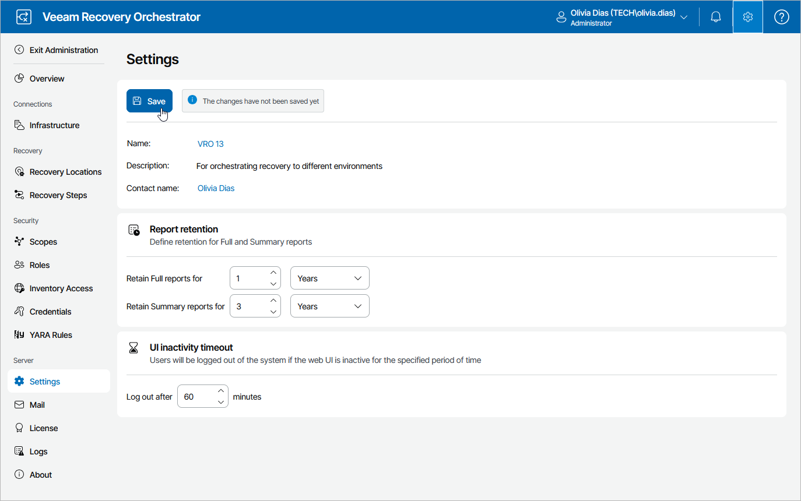

# Step 3. Configure Report Retention Settings

By default, Orchestrator retains full reports for 1 year and summary reports for 3 years in its database. However, you can specify any other time period, which allows you to consume less storage space by deleting reports that are older than the specified period:

1. Switch to the Administration page.
2. Navigate to Settings.
3. In the Report retention section, specify for how long you want full and summary reports to be retained in the Orchestrator database.
4. Click Save.

|  |
| --- |
| Important |
| The specified retention settings will apply to all Orchestrator reports in all scopes. |

