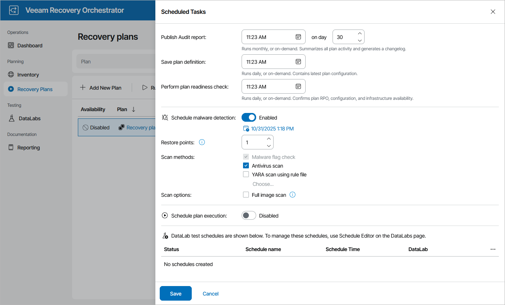

# Configuring Scan Scheduling

You can schedule a time to perform a malware scan for a plan. To do that:

1. Navigate to Recovery Plans.
2. Select the plan that you want to scan for malware.
3. From the Manage menu, select Schedule.

OR-

Right-click the plan name and select Manage > Schedule.

1. In the Scheduled Tasks window, set the Schedule malware detection toggle to Enabled and do the following:

1. Click the Configure schedule link to set the necessary schedule and specify recurrence settings, and click Save.
2. In the Restore points field, specify the number of restore points on each machine that you want to scan for malware.

By default, Orchestrator checks the most recent restore point. However, if you specify to scan more than 1 restore point, Orchestrator will perform scanning starting from the earliest available restore point to the most recent one. If all of the restore points are infected, the plan will acquire the NOT VERIFIED state after the scan process completes.

For more information on the way Orchestrator chooses restore points for malware scan, [How Orchestrator Selects Restore Points During On-Demand Malware Scan](understanding_restore_point_selection_malware.md).

1. [Applies only to restore and cloud plans] Choose whether you want to scan the restore points created for machines included in the plan with antivirus software, a YARA rule or both.
2. [Applies only if you have selected Virus scan, YARA scan using rule file or both] By design, Orchestrator scans the restore point until a virus or YARA rule match is detected. Then, Orchestrator either completes the scanning session or proceeds to the next restore point in case you have specified several restore points to scan at step 4b. However, you can instruct Orchestrator to continue scanning the restore point until all viruses and YARA rule matches are detected. To do that, select the Full image scan check box.
3. To save changes made to the plan malware schedule, click Save.

