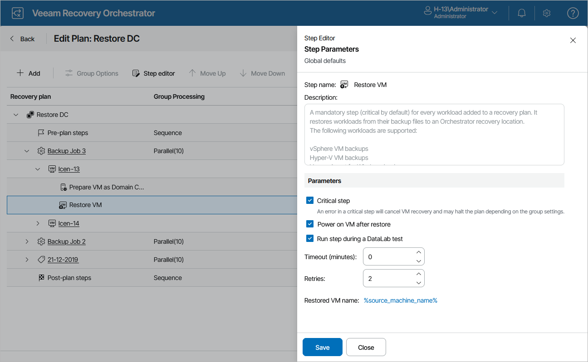

# Configuring Step Parameters

For each plan step performed during recovery, you can customize parameter settings:

1. Navigate to Recovery Plans.
2. Select the plan that contains a VM whose step you want to edit and click Manage > Edit. The Edit Plan page will open.
3. On the Edit Plan page, in the Recovery plan column, expand the plan to see all its inventory groups. Then, expand the necessary inventory group, select a VM whose step parameters you want to edit, and click Step editor.
4. In the Step Editor window, select the necessary step and click Step parameters.
5. In Step parameters window, set the desired step parameter values and click Save.

For detailed description of step parameters that you can configure for recovery plan steps, see [Appendix A. Recovery Plan Steps](appendix_plan_steps.md).

1. To save changes made to the plan settings, click Save Plan.

   

