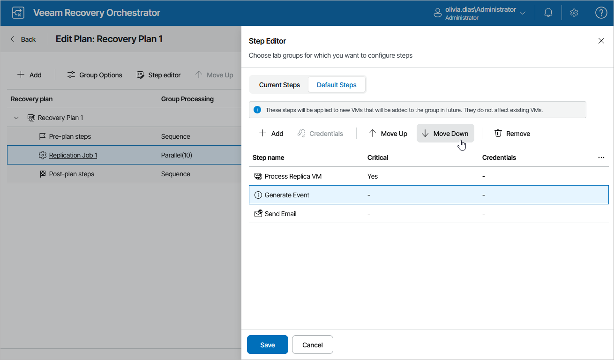

# Configuring Steps

For each machine included in a recovery plan, you can add and remove steps performed when processing the machine:

1. Navigate to Recovery Plans.
2. Select the plan that contains a machine whose steps you want to edit.
3. From the Manage menu, select Edit.

OR-

Right-click the plan name and select Manage > Edit.

1. On the Edit Plan page, expand the plan, select the necessary machine and click Step editor. The the Step Editor window will open.
2. In the Step Editor window, do the following:

* To change the step execution order, use the Move Up and Move Down arrows to move steps up and down the list.
* To remove a step, select the step and click Remove.
* To add a step, click Add. In the Add Recovery Steps window, click Add and select steps to be performed for each machine during restore.

For a step to be displayed in the Step name list, it must be added to the list of inventory items available for the scope, as described in section [Managing Inventory Items](managing_inventory_items.md). If a step is displayed as not available, this means that the step has already been added to the plan and cannot be added twice.

|  |
| --- |
| Note |
| If a VM is included in multiple inventory groups in the same plan, Orchestrator will only run the Restore VM step once. However, other steps for this VM will execute when processing it in each group. |

1. To save changes made to the plan settings, click Save.

|  |
| --- |
| Tip |
| You can simultaneously add steps for multiple machines in each inventory group. To do that, select an inventory group in the Recovery plan column and click Step editor. In the Step Editor window, choose whether you want to add current or default steps, and click Add. In the Add Recovery Steps window, select the required steps that you want to add and then click Save. |

