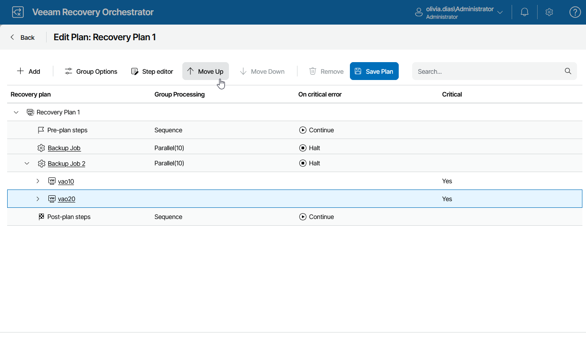

# Configuring Machines

The order in which machines in a recovery plan are processed depends on the Group Options configured when editing the plan:

* If the Recover VMs in > Sequence option is selected for an inventory group, machines in the group will be processed in the order they appear in the Recovery plan list.
* If the Recover VMs in > Parallel option is selected for an inventory group, a limited number of machines in the group will be processed at the same time.
* If new machines are added to an inventory group, the entire machine list will be resorted and then processed in the alphabetical order.

If some machines are dependent on other machines, ensure the required machines are started first. To define the recovery order for machines included in an inventory group:

1. Navigate to Recovery Plans.
2. Select the plan for which you want to change the group processing order and click Manage > Edit.
3. On the Edit Plan page, do the following:

1. Expand the plan to see all its inventory groups and select an inventory group in which you want to change the machine processing order.
2. To move the machine up or down the list, use the Up and Down arrows.
3. To save changes made to the plan settings, click Save Plan.

