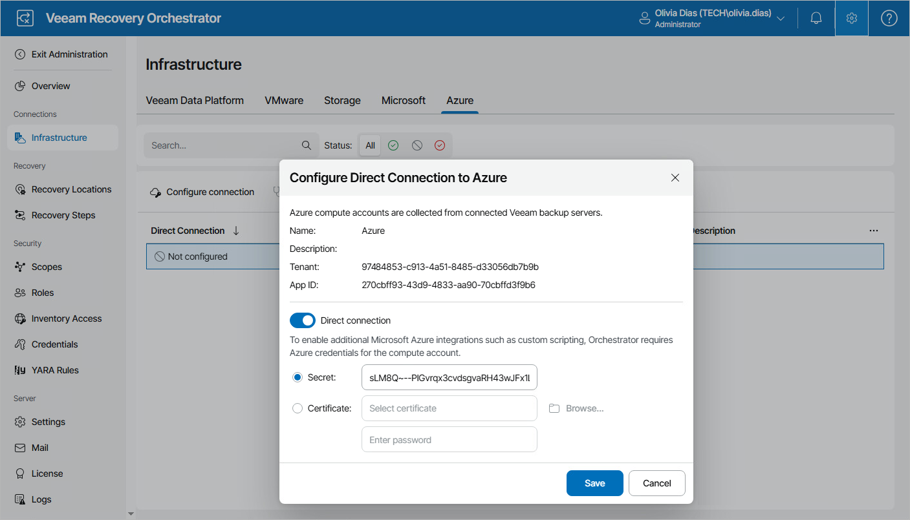

# Connecting Microsoft Azure Servers

No additional connection is required for recovery to Microsoft Azure as Orchestrator will use the Microsoft Azure compute and storage credentials configured on the connected Veeam Backup & Replication servers.

However, if you plan to execute custom scripts inside an Microsoft Azure machine managed by the connected Veeam Backup & Replication server, you must configure a direct connection to the Microsoft Azure compute account added to this server. To do that:

1. Switch to the Administration page.
2. Navigate to Infrastructure > Azure.
3. Choose the required connection and click Configure connection.
4. In the Configure Direct Connection to Azure window, do the following:

1. Set the Direct connection toggle to On.
2. Choose one of the following options:

* If you want to use password-based authentication, select the Secret option and specify the secret ID of the connected Microsoft Azure compute account.
* If you want to use certificate-based authentication, select the Certificate option, browse to a local folder to locate the self-signed public certificate and provide a password for this certificate.

For more information on Microsoft Azure authentication, see [Microsoft Docs](https://learn.microsoft.com/en-us/entra/identity-platform/howto-create-service-principal-portal#set-up-authentication).

1. Click Save.

|  |
| --- |
| Tip |
| By default Orchestrator, verifies the connection to Microsoft Azure once a day to ensure that the provided certificate or secret ID is valid. However, you can also check the connection manually. To do that, choose the connection and click Check connection. |

