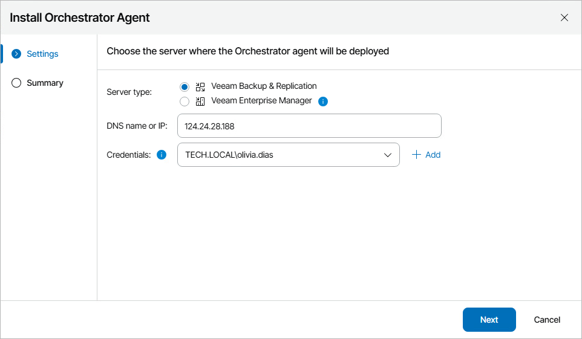
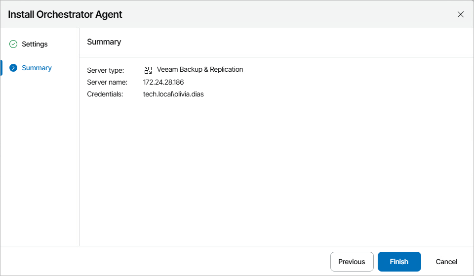

# Connecting Veeam Backup & Replication Servers

To be able to orchestrate a remote Veeam Backup & Replication server, you must deploy an Orchestrator agent on the server — the agent will trigger orchestration commands on that server. For Linux-based Veeam Backup & Replication servers, you must also enable remote data collection in the Veeam Host Management console as described in the Veeam Backup & Replication User Guide, section [Configuring Backup Infrastructure Settings](https://helpcenter.veeam.com/docs/vbr/userguide/hmc_configure_infrastructure.html?zoom_highlight=data+collection+request&ver=13#enabling-remote-data-collection).

If you have already connected servers during the initial Orchestrator UI configuration, you do not need to connect them again. For more information, see [After You Install](after_you_install.md).

|  |
| --- |
| Note |
| * Orchestrator supports connecting remote Veeam Backup & Replication servers that run the PostgreSQL and Microsoft SQL Server database systems. * Orchestrator does not support connecting remote Veeam Backup & Replication servers with enabled multi-factor authentication (MFA). To work around the issue, disable MFA for the Veeam Backup & Replication service account and connect the remote backup server using the credentials of this account. For more information on how to disable MFA, see the Veeam Backup & Replication User Guide, section [Multi-Factor Authentication](https://helpcenter.veeam.com/docs/vbr/userguide/mfa.html?ver=13#disabling-mfa). |

To deploy an Orchestrator agent on a remote Veeam Backup & Replication server:

1. Switch to the Administration page.
2. Navigate to Infrastructure > Veeam Data Platform.
3. Click Deploy Agent and choose whether you want to deploy an Orchestrator agent for Windows or for Linux.
4. Complete the Install Orchestrator Agent wizard:

1. At the Settings step of the wizard, specify the following connection settings:

1. Use the Server type options to specify whether the server is a Veeam Backup & Replication server or Veeam Backup Enterprise Manager server.

If you choose the Veeam Enterprise Manager option, Orchestrator agents will be deployed to all Veeam Backup & Replication servers managed by the Veeam Backup Enterprise Manager.

1. Use the DNS name or IP field to enter the DNS name or IPv4 address of the server where you want to deploy the Orchestrator agent. The maximum length of the location name is 256 characters; the following characters are not supported: \* : / \ ? @ [ ] ; : = + " < > | .

If you want to add a Veeam Backup & Replication server that is part of a [High Availability cluster](https://helpcenter.veeam.com/docs/vbr/userguide/high_availability_cluster.html?ver=13), you must specify the DNS name or IPv4 address of this cluster.

1. From the Credentials drop-down list, choose an account whose credentials will be used to connect to the server.

For an account to be displayed in the Credentials list, it must be added to the configuration database as described in section [Adding Credentials](adding_credentials_manually.md). If you have not set up an account beforehand, click Add and then provide the account name, password and description in the Add Credentials window. The account name must be specified in the DOMAIN\USERNAME or USERNAME format.

|  |
| --- |
| Note |
| If you want to connect a Veeam Backup Enterprise Manager server, you must specify the same service account that was used [when installing this server](https://helpcenter.veeam.com/docs/vbr/em/em_setup_specify_service_account.html?ver=13). |

Keep in mind that the account must have the permissions required to install and run the Orchestrator agent on Veeam Backup & Replication servers. For more information on the required account permissions, see [Permissions](permissions.md).

1. At the Summary step of the wizard, review the connection details and click Finish.

Note that after you deploy an Orchestrator agent on a remote Veeam Backup & Replication server or perform any infrastructure configuration changes, the changes may not appear in the Orchestrator UI immediately — the data synchronization process between Orchestrator and Veeam Backup & Replication may take up to 15 minutes to complete.

|  |
| --- |
| Important |
| If you connect a Linux-based Veeam Backup & Replication server that protects Windows-based machines, you must specify a Windows-based server as the default mount backup server in Veeam Backup & Replication to be able to recover these machines. For more information, see the Veeam Backup & Replication User Guide, section [Mount Servers](https://helpcenter.veeam.com/docs/vbr/userguide/mount_server.html?ver=13). |

Related Topics

* [Uninstalling Orchestrator Agents](uninstalling_vro_agents.md)
* [Repairing Orchestrator Agents](repairing_vro_agents.md)

