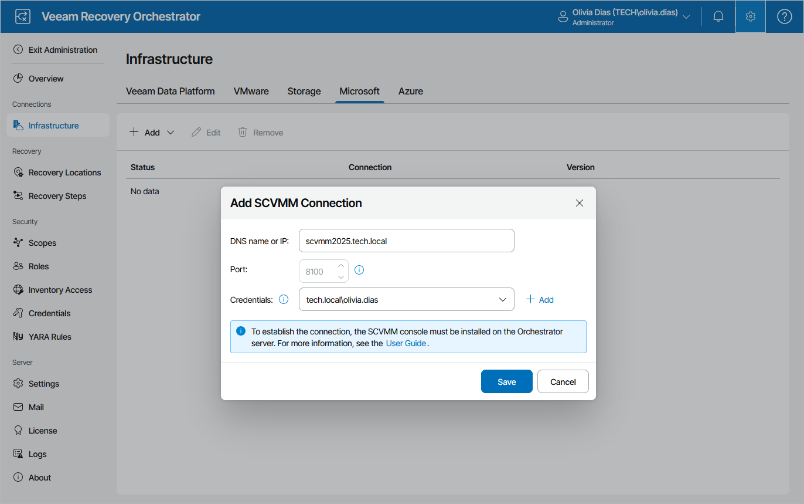

# Connecting Microsoft Hyper-V Servers

To collect data about Microsoft Hyper-V infrastructure objects, you must configure connections either to Microsoft System Center Virtual Machine Manager (SCVMM) servers or standalone clusters.

Note that before you start adding a connection, it is recommended that you make sure that all the Microsoft Hyper-V infrastructure objects are online. Otherwise, if you bring these objects online after adding the connection, Veeam Recovery Orchestrator will not be able to collect their data immediately since the data synchronization process between Orchestrator and Microsoft Hyper-V may take up to 2 hours to complete.

|  |
| --- |
| Important |
| * To allow Orchestrator to connect to an SCVMM server, you must first install the SCVMM console on the machine that runs Orchestrator as described in [Microsoft Docs](https://learn.microsoft.com/en-us/system-center/vmm/install-console?view=sc-vmm-2025).   Keep in mind that the SCVMM version of the console must match the System Center version of the server.   * If the SCVMM server or standalone cluster that you want to connect to Orchestrator is added to a backup server, you must first upgrade the server or cluster to Veeam Backup & Replication version 12.3. Otherwise, the server or cluster will no longer be able to connect to the backup server, which may affect data protection.   To upgrade Veeam Backup & Replication to version 12.3, follow the instructions provided in the Veeam Backup & Replication User Guide, section [Upgrading to Veeam Backup & Replication 12.3](https://helpcenter.veeam.com/docs/vbr/userguide/upgrade_vbr.html?ver=13), and in [this Veeam KB article](https://www.veeam.com/kb2053). |

Connecting SCVMM Servers

To configure a connection to an SCVMM server:

1. Switch to the Administration page.
2. Navigate to Infrastructure > Microsoft.
3. Click Add > SCVMM.
4. In the Add SCVMM Connection window, do the following:

1. Use the DNS name or IP field to enter the DNS name or IPv4 address of the SCVMM server that will be connected to the Orchestrator agent. The maximum length of the location name is 128 characters.

If you want to add an SCVMM server that is part of a [backup infrastructure already connected](connecting_backup_servers.md) to Orchestrator, you must add the server using the same DNS name or IPv4 address as in the backup infrastructure to avoid synchronization issues.

1. From the Credentials drop-down list, choose the necessary account for connecting to the SCVMM server. For an account to be displayed in the Credentials list, it must be added to the configuration database as described in section [Adding Credentials](adding_credentials_manually.md). If you have not set up an account beforehand, click Add and follow the steps of the Add Credential wizard. For more information on the required account permissions, see [Permissions](permissions.md).

1. Click Save.

Note that after you configure a connection to an SCVMM server or perform any infrastructure configuration changes, the changes may not appear in the Orchestrator UI immediately — the data synchronization process between Orchestrator and Microsoft Hyper-V may take up to 15 minutes to complete.

Connecting Hyper-V and Azure Local Clusters

|  |
| --- |
| Important |
| Each cluster must be added to the Orchestrator infrastructure only once — either as a direct connection or as part of an SCVMM hierarchy. |

To configure a connection to a standalone Hyper-V or Azure Local cluster:

1. Switch to the Administration page.
2. Navigate to Infrastructure > Microsoft.
3. Click Add > Hyper-V Cluster.
4. In the Add Hyper-V Cluster window, do the following:

1. Use the DNS name or IP field to enter a DNS name or an IPv4 address of the cluster that will be connected to the Orchestrator agent. The maximum length of the location name is 128 characters.

|  |
| --- |
| Note |
| If you want to add a Hyper-V or Azure Local cluster that is part of a [backup infrastructure already connected](connecting_backup_servers.md) to Orchestrator, make sure that you add the cluster using the same DNS name or IPv4 address as in the backup infrastructure to avoid synchronization issues. |

1. From the Credentials drop-down list, choose the necessary account for connecting to the cluster. For an account to be displayed in the Credentials list, it must be added to the configuration database as described in section [Adding Credentials](adding_credentials_manually.md). If you have not set up an account beforehand, click Add and follow the steps of the Add Credential wizard. For more information on the required account permissions, see [Permissions](permissions.md).

1. Click Save.

Note that after you configure a connection to a standalone cluster or perform any infrastructure configuration changes, the changes may not appear in the Orchestrator UI immediately — the data synchronization process may take up to 15 minutes to complete.

Related Topics

[Removing Microsoft Hyper-V Servers](removing_scvmm_servers.md)

