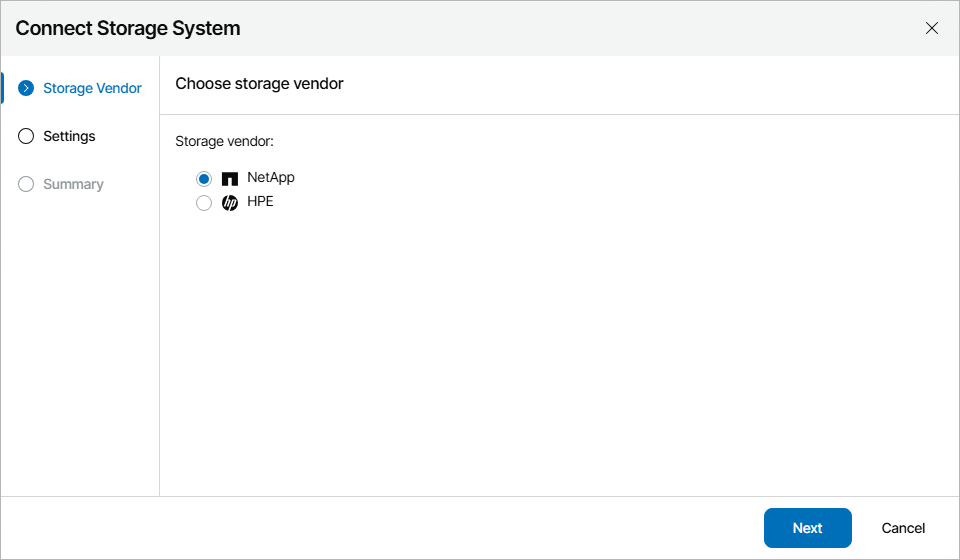
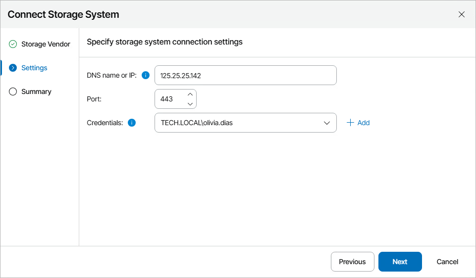
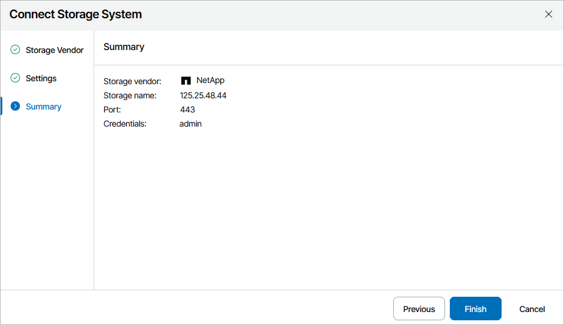

# Connecting Storage Systems

The following NetApp storage systems must be connected to Orchestrator:

* Any active storage virtual machine (SVM) that will be the source of the datastore disaster recovery relationship.
* Any active SVM that will be the destination of the SVM disaster recovery relationship.

|  |
| --- |
| Important |
| Make sure that you have NetApp volumes and virtual volumes protected by storage replication. If you use authentication configured to control access to iSCSI targets, make sure that you define a list of initiators and their authentication methods for all hosts managed by the target vCenter Server. For more information on iSCSI initiator security management, see the [NetApp ONTAP Documentation Center](https://docs.netapp.com/us-en/ontap/data-protection/snapmirror-replication-concept.html). For more information on configuring CHAP parameters for iSCSI adapters, see [VMware Docs](https://docs.vmware.com/en/VMware-vSphere/8.0/vsphere-storage/GUID-AC65D747-728F-4109-96DD-49B433E2F266.html). |

The following HPE storage systems must be connected to Orchestrator:

* Any active storage system that will be the primary system of the remote copy configuration.
* Any active storage system that will be the secondary system of the remote copy configuration.

|  |
| --- |
| Important |
| Consider the following:   * To connect a NetApp storage system, the ONTAPI REST API (ZAPI) must be enabled. * To connect an HPE storage system, you must first enable the HPE 3PAR Web Services API (WSAPI) server as described in section [Enabling HPE 3PAR Web Services API Server](enabling_web_server.md). * Connecting HPE storage systems paired in synchronous long distance (SLD) Remote Copy configurations is not supported. For more information on SLD configurations, see the [Hewlett Packard Enterprise Support Center](https://support.hpe.com/). |

To configure a connection to a storage system:

1. Switch to the Administration page.
2. Navigate to Storage.
3. Click Add.
4. Complete the Connect Storage System wizard:

1. At the Storage Vendor step of the wizard, choose whether you want to connect a NetApp or an HPE storage system.

1. At the Settings step of the wizard, specify the following connection settings:

1. Use the DNS name or IP field to enter the DNS name or IPv4 address of the storage system that will be connected to the Orchestrator server. The maximum length of the location name is 128 characters; the following characters are not supported: \* : / \ ? " < > | .

If you want to add a storage system that is part of a [backup infrastructure already connected](connecting_backup_servers.md) to Orchestrator, you must add the storage system using the same DNS name or IPv4 address as in the backup infrastructure to avoid synchronization issues.

1. From the Credentials drop-down list, choose the necessary account for connecting to the storage system.

For an account to be displayed in the Credentials list, it must be added to the configuration database as described in section [Adding Credentials](adding_credentials_manually.md). If you have not set up an account beforehand, click Add and follow the steps of the Add Credential wizard. For more information on the required account permissions, see [Permissions](permissions.md).

1. If required, change the port number used for communication with the system.

If an untrusted security certificate is installed on the storage system, you will get a security warning. You can view the certificate and click Remember and continue — in this case, Orchestrator will remember the certificate thumbprint and will further trust the certificate when connecting to the storage system. Otherwise, you will not be able to proceed with the wizard.

1. At the Summary step of the wizard, review the connection details and click Finish.

Note that after you configure a connection to a storage system or perform any infrastructure configuration changes, the changes may not appear in the Orchestrator UI immediately — the data synchronization process between Orchestrator and the storage infrastructure may take up to 15 minutes to complete.

|  |
| --- |
| Important |
| After you connect a storage system to Orchestrator, you must include the system in a [storage recovery location](managing_recovery_locations.md#storage) (either new or already existing) so that Orchestrator can use this storage system when executing and testing [storage plans](working_with_storage_plans.md). To learn how to include target storage systems in storage recovery locations, see [Adding Storage Recovery Locations](storage_location_compute_resources.md). |

Related Topics

[Enabling HPE 3PAR Web Services API Server](enabling_web_server.md)

