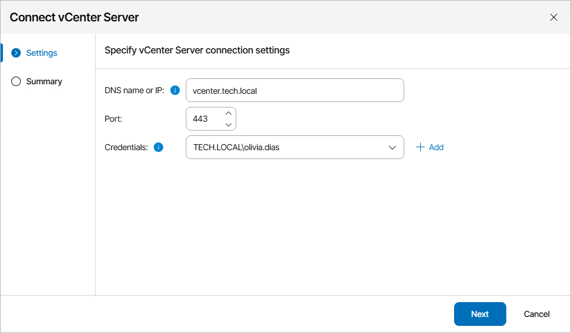
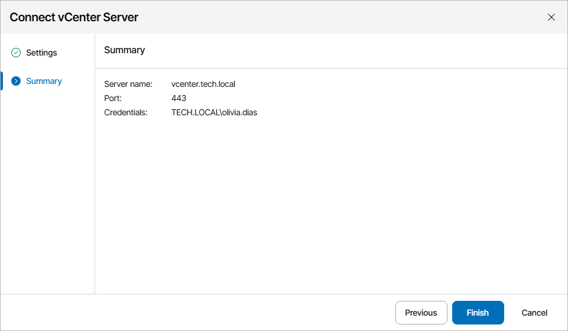

# Connecting VMware vSphere Servers

To collect data about VMware vSphere infrastructure objects, you must configure connections to VMware vSphere servers. Only connections to vCenter Servers are supported.

|  |
| --- |
| Important |
| To allow Orchestrator to process resource groups properly, you must connect vCenter Servers — not standalone ESXi hosts — to Veeam Backup & Replication servers orchestrated by Orchestrator. To learn how to add vCenter Servers to the backup infrastructure, see the Veeam Backup & Replication User Guide, section [Virtualization Servers and Hosts](https://helpcenter.veeam.com/docs/vbr/userguide/add_vmware_server.html?ver=13). |

It is required that Orchestrator has connections to the following vCenter Servers:

* All vCenter Servers managing source and replica VMs.
* The vCenter Server managing resources that will be used to recover VMs.
* All vCenter Servers managing VMs whose disks are located on the [connected storage systems](connecting_storage_systems.md).

|  |
| --- |
| Important |
| Starting from VMware vSphere version 7.0 Update 3, [vSphere Cluster Services (vCLS)](https://docs.vmware.com/en/VMware-vSphere/7.0/com.vmware.vsphere.resmgmt.doc/GUID-96BD6016-4BE7-4B1C-8269-568D1555B08C.html) is activated by default. Before you connect to a vCenter Server version 7.0 Update 3, you must configure vCLS datastore placement in the vSphere Client as described in [VMware vSphere documentation](https://docs.vmware.com/en/VMware-vSphere/7.0/com.vmware.vsphere.resmgmt.doc/GUID-6C11D7F9-4E92-4EA8-AA63-AABAD4B299E7.html). |

To configure a connection to a vCenter Server:

1. Switch to the Administration page.
2. Navigate to Infrastructure > VMware.
3. Click Add.
4. Complete the Connect vCenter Server wizard:

1. At the Settings step of the wizard, specify the following connection settings:

1. Use the DNS name or IP field to enter the DNS name or IPv4 address of the vCenter Server that will be connected to the Orchestrator agent. The maximum length of the location name is 256 characters; the following characters are not supported: \* : / \ ? @ [ ] ; : = + " < > | .

If you want to add a vCenter Server that is part of a [backup infrastructure already connected](connecting_backup_servers.md) to Orchestrator, you must add the server using the same DNS name or IPv4 address as in the backup infrastructure to avoid synchronization issues.

1. From the Credentials drop-down list, choose the necessary account for connecting to the server. For an account to be displayed in the Credentials list, it must be added to the configuration database as described in section [Adding Credentials](adding_credentials_manually.md). If you have not set up an account beforehand, click Add and follow the steps of the Add Credential wizard. For more information on the required account permissions, see [Permissions](permissions.md).
2. If required, change the port number used for communication with the server.

If an untrusted security certificate is installed on the vCenter Server, you will get a security warning. You can view the certificate and click Remember and Continue — in this case, Orchestrator will remember the certificate thumbprint and will further trust the certificate when connecting to the server. Otherwise, you will not be able to add the server.

1. At the Summary step of the wizard, review the connection details and click Finish.

Note that after you configure a connection to a vCenter Server or perform any infrastructure configuration changes, the changes may not appear in the Orchestrator UI immediately — the data synchronization process between Orchestrator and VMware vSphere may take up to 15 minutes to complete.

Related Topics

[Removing VMware vSphere Servers](removing_vsphere_servers.md)

