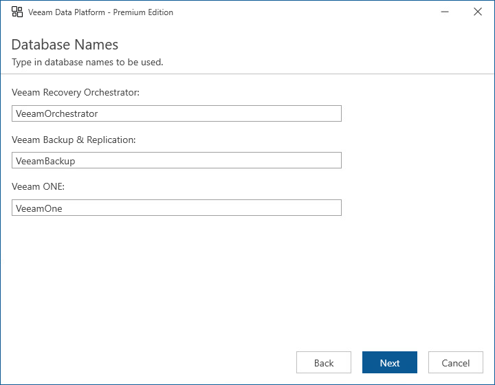

# Step 11. Create SQL Server Databases

[This step applies only if you have clicked Customize Settings at the Ready to Install step of the setup wizard]

At the Database Names step of the wizard, enter names for databases that will be used to store data collected from Orchestrator, Veeam Backup & Replication and Veeam ONE.

