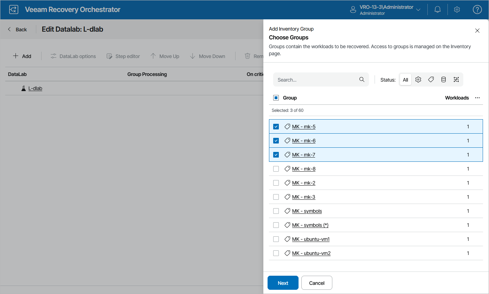

# Creating Lab Groups

In most cases, a machine does not work in isolation but has dependencies on other services and components, such as Active Directory or DNS. To verify such a machine, the DataLab will have to supply all services on which this machine is dependent. For this purpose, Orchestrator uses lab groups.

|  |
| --- |
| Note |
| If a recovery plan contains a particular inventory group or machine, it is recommended that you do not test this plan in a DataLab that includes a lab group with the same machine or inventory group. |

To create a lab group:

1. Navigate to DataLabs.
2. In the DataLab column, select a DataLab for which you want to create the lab group, and click DataLab Editor.

For a DataLab to be displayed in the DataLab list, it must be added to the scope as described in section [Managing Inventory Items](managing_inventory_items.md).

1. On the Edit DataLab page, click Add.
2. In the Add Inventory Group window, select inventory groups that you want to include in the DataLab and click Next.

For an inventory group to be displayed in the Group list, it must be added to the list of inventory items available for the scope, as described in section [Managing Inventory Items](managing_inventory_items.md).

1. In the Group Options window, do the following:

1. In the Group settings section, choose whether the lab group will contain VMs recovered from backups, replicas or CDP replicas.
2. In the Processing logic section, choose how Orchestrator will process VMs in this lab group. For more information on the group settings, see [Configuring Groups](configuring_group_settings.md).
3. Review configuration information and click Apply.

|  |
| --- |
| Note |
| When you remove a DataLab from a scope, all lab groups in the DataLab are automatically deleted from the DataLab. |

Related Topics

* [Configuring Lab Groups](configuring_lab_groups.md)
* [Working with Default Lab Groups](default_lab_groups.md)

