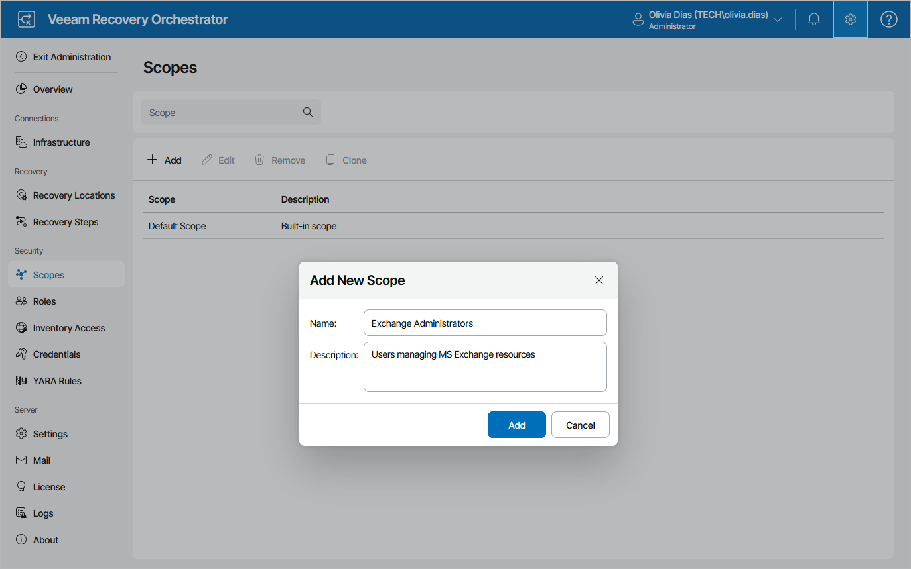

# Creating Scopes

To create a new scope:

1. Switch to the Administration page.
2. Navigate to Scopes.
3. Click Add.
4. In the New Scope window:

1. Use the Name and Description fields to enter a name for the new scope and to provide a description for future reference.

The maximum length of the scope name is 128 characters; the following characters are not supported: \* : / \ ? " < > | .

1. Click Apply to save the scope.

