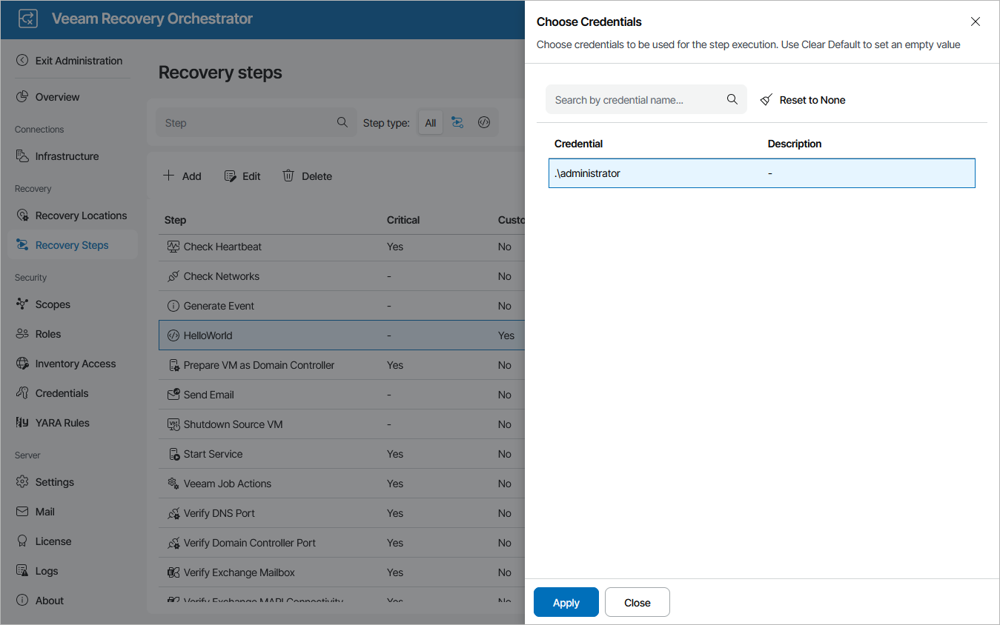

# Configuring Windows Credentials Parameter

If you want to provide credentials that the script will use to run within the guest OS of a machine included in the plan, do the following:

1. Add credentials that the script will use to connect to the machine when performing recovery as described in section [Managing Credentials](managing_credentials.md).
2. Navigate to Recovery Steps.
3. In the Steps column, select the step and click Edit.
4. In the Step Editor window, do the following

1. In Script Execution Location field, select In-Guest OS.
2. Click the link in the Windows credentials field, select the necessary credentials in the Choose Credentials window and click Apply.
3. To save changes made to the script, click Save.

|  |
| --- |
| Note |
| If you do not specify any credentials, the script will fail to run, and the [Readiness Check test](running_readiness_check.md) will report that the Windows Credentials parameter settings are not configured. |

Related Topics

[Adding Credentials Parameter to Your Script](adding_credentials.md)

