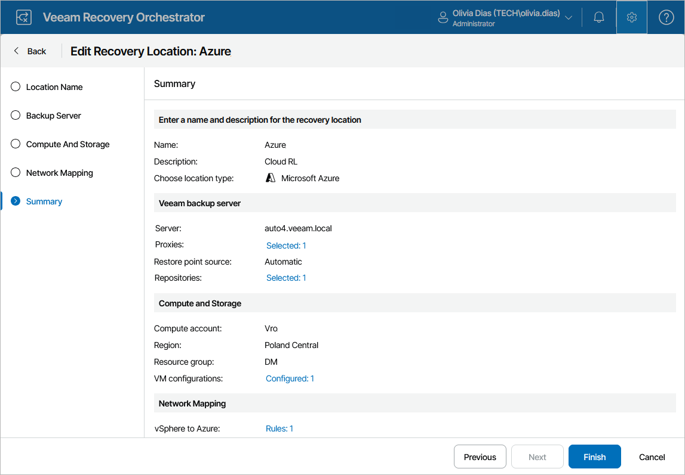

# Editing Microsoft Azure Recovery Locations

For each Microsoft Azure recovery location, you can modify settings configured while creating the location:

1. Switch to the Administration page.
2. Navigate to Recovery Locations.
3. Select the location and click Edit.
4. Complete the Edit Recovery Location wizard:

1. To change the name and description of the location, follow the instructions provided in section [Adding Microsoft Azure Recovery Location](cloud_location_name.md) (step 1).
2. To modify the specified recovery options and change the Veeam Backup & Replication server that will manage the process of recovering machines to Microsoft Azure, follow the instructions provided in section [Adding Microsoft Azure Recovery Locations](cloud_location_backup_servers.md) (step 3).
3. To configure the specified Microsoft Azure settings, follow the instructions provided in section [Adding Microsoft Azure Recovery Locations](cloud_location_compute_storage.md) (step 4).
4. To configure network mapping and modify the specified quarantine network, follow the instructions provided in section [Adding Microsoft Azure Recovery Locations](cloud_location_network_mapping.md) (step 5).
5. At the Summary step of the wizard, review configuration information and click Finish to confirm the changes.

