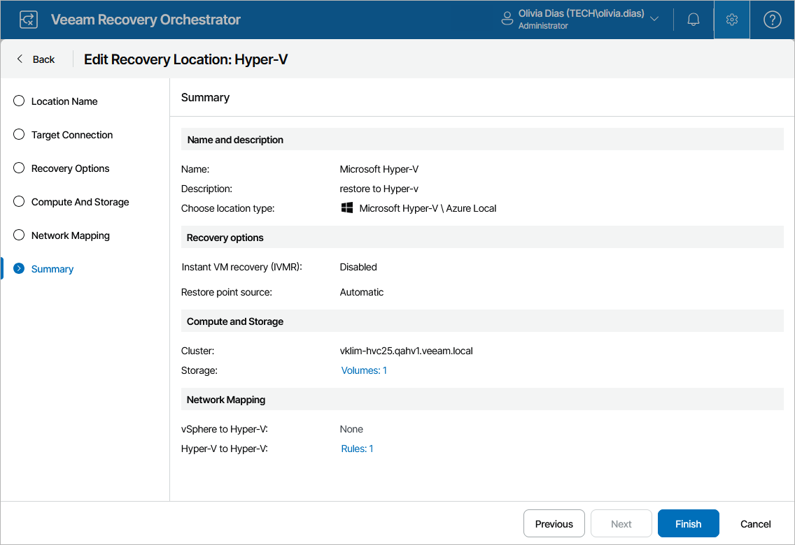

# Editing Microsoft Hyper-V Recovery Locations

For each Microsoft Hyper-V recovery location, you can modify settings configured while creating the location:

1. Switch to the Administration page.
2. Navigate to Recovery Locations.
3. Select the location and click Edit.
4. Complete the Edit Recovery Location wizard:

1. To change the name and description of the location, follow the instructions provided in section [Adding Microsoft Hyper-V Recovery Locations](hyperv_location_name.md) (step 1).
2. To change the connection of the selected cluster, follow the instructions provided in section [Adding Microsoft Hyper-V Recovery Locations](hyperv_location_connection.md) (step 3).
3. To change the specified recovery options, follow the instructions provided in section [Adding Microsoft Hyper-V Recovery Locations](hyperv_location_recovery_options.md) (step 4).
4. To change the specified SCVMM server, cluster and target CSV disks, follow the instructions provided in section [Adding Microsoft Hyper-V Recovery Locations](hyperv_location_server.md) (step 5).
5. To configure network mapping, follow the instructions provided in section [Adding Microsoft Hyper-V Recovery Locations](hyperv_location_network_mapping.md) (step 6).
6. At the Summary step of the wizard, review configuration information and click Finish to confirm the changes.

