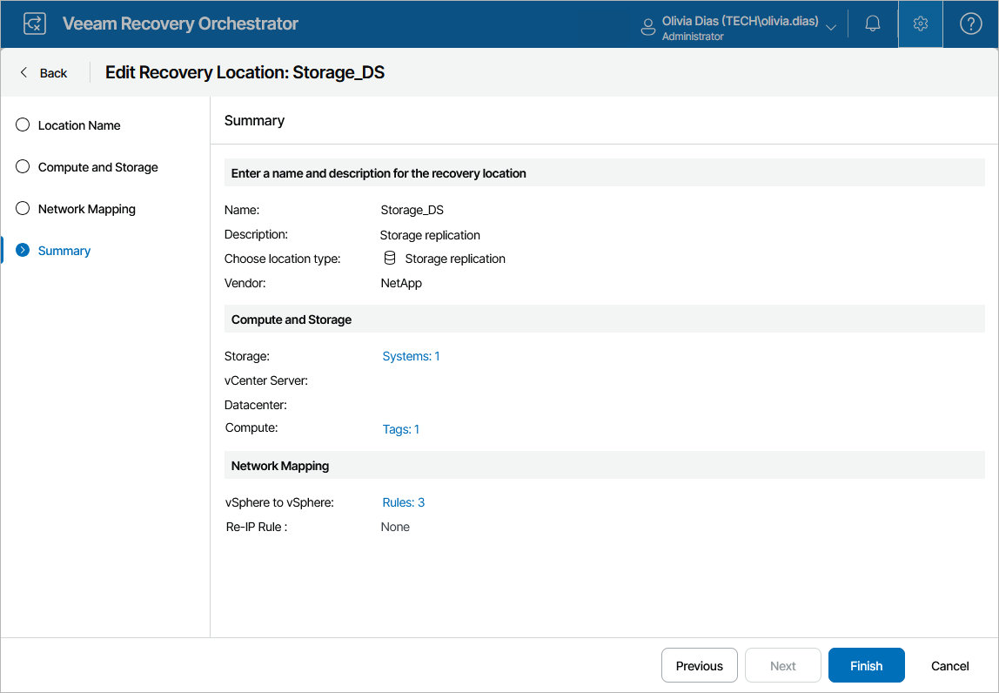

# Editing Storage Recovery Locations

For each storage recovery location, you can modify settings configured while creating the location:

1. Switch to the Administration page.
2. Navigate to Recovery Locations.
3. Select the location and click Edit.
4. Complete the Edit Recovery Location wizard:

1. To change the name and description of the location, follow the instructions provided in section [Adding Storage Recovery Locations](storage_location_name.md) (step 1).
2. To change the specified compute and storage resources, follow the instructions provided in section [Adding Storage Recovery Locations](storage_location_compute_resources.md) (step 4).
3. To configure network mapping and re-IP rules, follow the instructions provided in section [Adding Storage Recovery Locations](storage_location_network_mapping.md) (step 5).
4. At the Summary step of the wizard, review configuration information and click Finish to confirm the changes.

