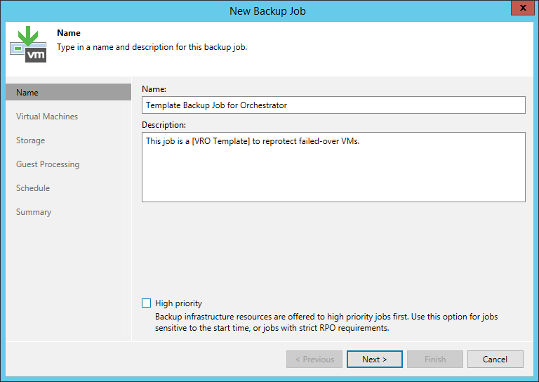

# Editing Template Jobs

When you create a [replica](creating_replica_plans.md) or [restore](creating_restore_plans.md) plan, you have an option to reprotect machines included in the plan as soon as the recovery process completes. Orchestrator will automatically create a new replication or backup job to reprotect the recovered VMs as part of the plan execution process. Keep in mind that you cannot reprotect VMs recovered to a Microsoft Hyper-V environment.

To accomplish this, configure a template job on the Veeam Backup & Replication server that protects the required machines and is connected to your Orchestrator server. For Orchestrator to discover the job as a template, you must create a standard backup or replication job and include the text [VRO Template] in the job description.

|  |
| --- |
| Note |
| When creating a new replication or backup job, Orchestrator will copy all settings configured for the template job — except for the guest processing settings. If you want to enable application-aware processing for machines included in the plan, edit settings of the newly created job as described in the Veeam Backup & Replication User Guide, sections [Creating Backup Jobs](https://helpcenter.veeam.com/docs/vbr/userguide/backup_job_vss_application_vm.html?ver=13) and [Creating Replication Jobs](https://helpcenter.veeam.com/docs/vbr/userguide/replica_vss_application_vm.html?ver=13). |

After you create a template job on the Veeam Backup & Replication server, Orchestrator will collect this data and display it in the Orchestrator UI. Note that the data synchronization process between Orchestrator and the Veeam Backup & Replication server may take several minutes to complete.

|  |
| --- |
| Note |
| The Orchestrator template job can be configured per-inventory group in a plan. To do that, select the Reprotect group check box when editing the plan. With this option selected, a new job will be created for the inventory group. For more information, see [Configuring Group Settings](configuring_group_settings.md). |

