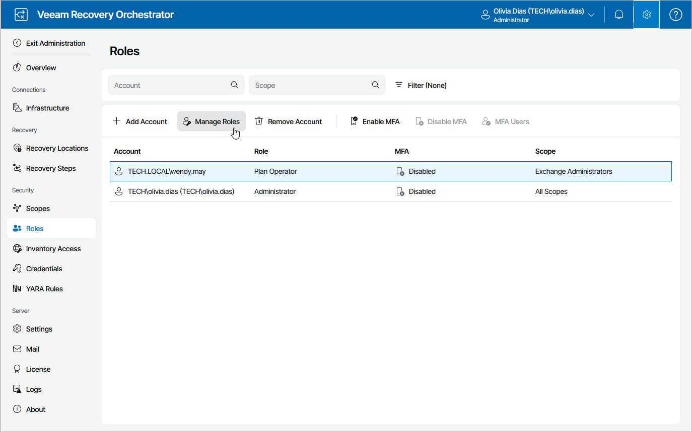

# Editing User Roles and Scopes

To edit role and scope pairs assigned to the user account, do the following:

1. Switch to the Administration page.
2. Navigate to Roles.
3. Select the user account that you want to edit and click Manage Roles.
4. In the Manage Roles wizard:

1. At the Roles and scopes step, modify role and scope pairs assigned to the user account.
2. At the Summary step, review configuration information and click Finish.

