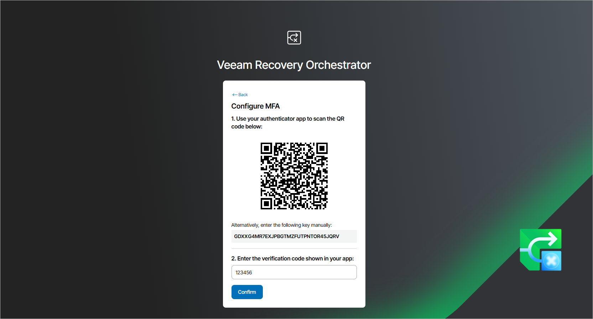

# Enabling and Disabling Multi-Factoring Authentication

Veeam Recovery Orchestrator supports multi-factor authentication (MFA) for additional user verification, which allows Administrators to enable, disable and reset MFA for all users and user groups working with the Orchestrator UI. MFA in Veeam Recovery Orchestrator is based on the Time-based One-Time Password (TOTP) method that requires the user to verify their identity by providing a temporary six-digit code generated by an authentication application running on a trusted device.

To enable or disable MFA, do the following:

1. Switch to the Administration page.
2. Navigate to Roles.
3. Click Enable MFA or Disable MFA. As a result, the statuses of all user accounts added to Orchestrator will change to Not configured or Disabled.

When a user logs in to the Orchestrator UI for the first time, they must do the following:

1. Install a supported authentication application on a trusted device. Note that only Google Authenticator and Microsoft Authenticator are fully supported by Orchestrator.
2. Scan the displayed QR code using the camera of the trusted device.
3. Enter a verification code generated by the authentication application. Note that mobile push notifications are not supported — you can get a verification code only in the authentication application installed at step 1.

|  |
| --- |
| Important |
| To avoid connection failures, make sure that the system time on the trusted device that you are using is synchronized with the system time on the machine where Orchestrator is installed. |

1. Click Confirm. As a result, the status of the user account will change to Configured.

|  |
| --- |
| Tip |
| * In case a user loses access to their trusted device, an Administrator can reset MFA for this user. To do that, click MFA Status, choose the necessary user and click Reset MFA. The next time the user logs in to the Orchestrator UI, they will have to scan the QR code again using another trusted device. * If an Administrator loses access to their trusted device and there are no more Administrators added to Orchestrator, this Administrator will not be able to reset MFA for themselves and will no longer be able to log in to the Web UI — unless they are part of a user group with the Administrator role assigned.   As a workaround, the Administrator can add a new user to the user group in Windows settings of their workstation or domain controller. Since Windows settings are synchronized with the configuration database of the Orchestrator server, the new user will also be added to the user group in Orchestrator and then will become able to reset MFA for the Administrator and all other users. |

