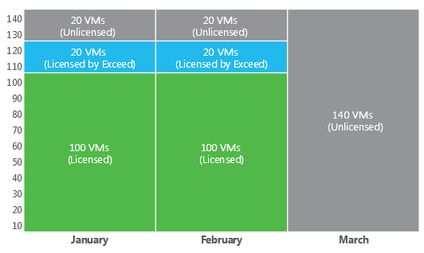
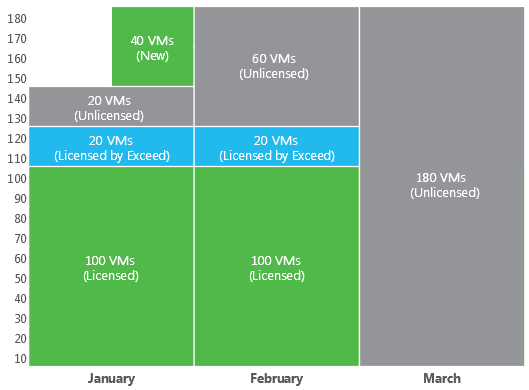

# Example

Consider the following example. Your Rental license covers 100 VMs. The license expires in 60 days.

At the beginning of January, the number of VMs is 140. Within the first 2 months (January and February), Orchestrator will manage 100 + 20 VMs that were added to recovery plans first (license limit + 20% allowed increase). 20 VMs that were added last will not be managed.

If the license is not updated upon expiration, in March, Orchestrator will change the status of all 140 VMs to Unlicensed.

Consider the same example but with [New VMs](new_vms.md).

In the middle of January, 40 New VMs are added to recovery plans. Orchestrator will manage these VMs until the end of the month. If the license is not updated, and the license pool is not increased, in February, Orchestrator will change the license statuses as follows:

* The first 20 VMs that obtained the Licensed by Exceed status in January will keep the same Licensed by Exceed status.
* The second 20 VMs that obtained the Unlicensed status in January will keep the same Unlicensed status.
* The last 40 VMs added in the middle of January will obtain the Unlicensed status according to the FIFO queue.

If the license is not updated upon expiration, and the license pool is not increased, in March, Orchestrator will change the status of all 180 VMs to Unlicensed.

