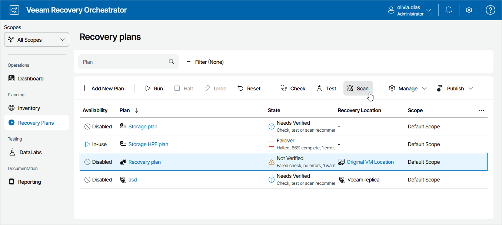
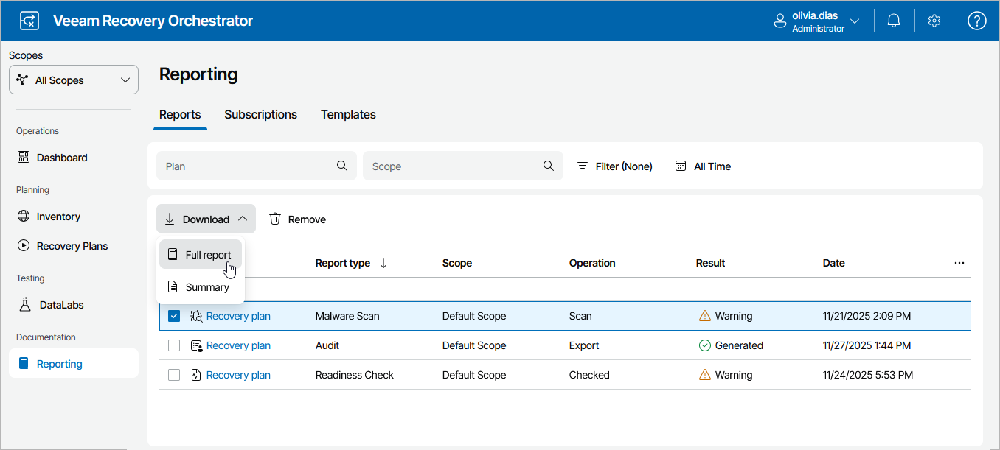

# Generating Malware Scan Report

After you check a plan for possible malware, Orchestrator will generate the Malware Scan Report. The report contains:

* Details on the check for malware flags.
* Results on the scan of restore points with antivirus software.
* Details on the performed YARA scan.

Orchestrator generates two types of reports:

* A summary report that includes a plan overview, information on all VM groups included in the plan and a summary on all the performed malware checks.
* A full report that also includes information on all VMs included in the plan.

Generating Malware Scan Report

To generate the report for a recovery plan:

1. Navigate to Recovery Plans.
2. Select the plan and click Scan.

Downloading Malware Scan Report

To access the report for a recovery plan:

1. Navigate to Reporting.
2. Select the report.
3. Click the plan name to download a summary report.

-OR-

Click Download and choose whether you want to download a summary or full report.

The Malware Scan Report will use the default report template or a [custom template](managing_templates.md). The results of malware scan will be appended at the end of the template.

